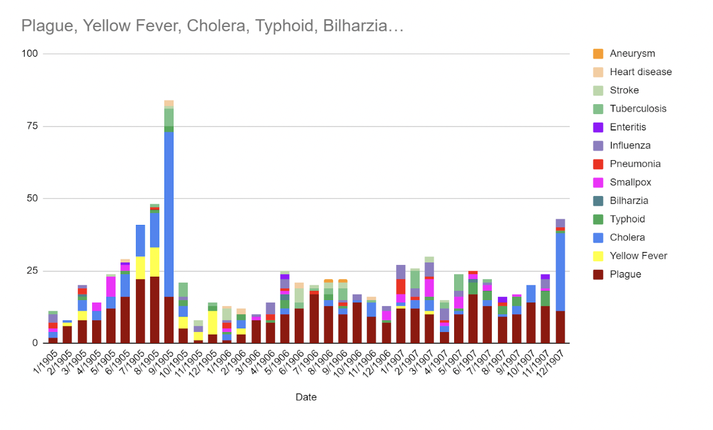
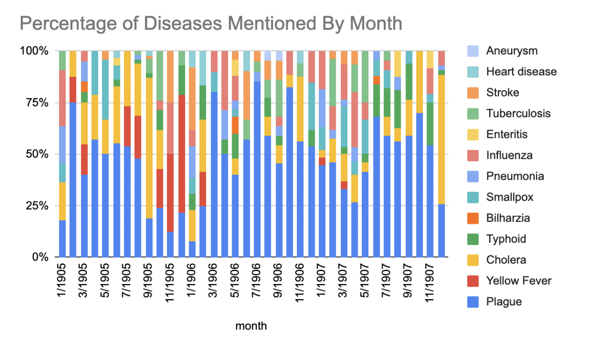

Subject:
Group Analysis Project
From:
Grace Damato <gad22@fsu.edu>
Date:
11/30/22, 3:26 PM
To:
Will Hanley <whanley@fsu.edu>

---

title: "Mentions of Disease in the Egyptian Gazette"

authors: [GraceDamato, FionaDiniger, ElenaBeggs]

date: 2022-11-30

categories: [analysis]

---

 

The question our group sought to answer was how the number of mentions of diseases in the Egyptian Gazette differs according to when they were discovered. We analyzed the frequency at which 14 different diseases were mentioned in the Gazette from January 1905 to December 1907 and compared the results to how recently the disease had been discovered for the people in this time. In order to collect the data on how often specific illnesses were referenced, our group employed the use of both target word searches in the content repository as well as tailored XPath queries. The queries focused on finding mentions of the different diseases. We accounted for spelling differences such as with smallpox by performing multiple queries per disease when necessary (ex. “smallpox” and “small pox”). These word searches produced an information set that revealed mentions by month of Pneumonia, Epilepsy, Smallpox, Yellow fever, Aneurysm, Heart disease, Stroke, Cholera, Bilharzia, Enteritis, Typhoid, Tuberculosis, and Influenza. For the plague, we used the XPath:

`//div[matches(.,'plague' ,'i')]/*[not(matches(.,'cattle'))]/*[not(matches(.,'locust'))]/head`

This specific XPath is designed to find how often Headlines containing the word “plague” are found in the Egyptian Gazette. Not only that, but because we are looking for Sapien incidents, the XPath excluded instances where cattle or locusts were addressed in conjunction with “plague”.

One reason we chose the diseases mentioned in this analysis project is because of their application to our projects. However, we also primarily focused our attention on more commonly known diseases of the time, such as plague, cholera, and tuberculosis. We also included data on illnesses like stroke and heart disease in conjunction with contagious diseases. Furthermore, we considered epilepsy as a potential data point but discovered that the newspaper only mentioned it twice. Therefore, our work is not comprehensive of all diseases mentioned in the Egyptian Gazette, but it attempts to cover a variety of common and uncommon diseases occurring during that era.

Once the data on each disease was collected, it was organized into a list of dates detailing when they were mentioned in the Egyptian Gazette. The data was then separated by month and placed into two bar charts to visualize our findings. One reveals how many mentions there are of the individual diseases each month and separates the findings by color for comparative clarity. The second chart shows the total count of “new diseases” compared to “old diseases” from 1905 to 1907. For the sake of this analysis, “new diseases” are considered anything discovered within the last century of the Egyptian Gazette articles being written. “Old diseases” on the other hand are the remaining illnesses, chronic or acute, claimed to have been discovered before the 19th century. This classification system was created to be based on how the readers and authors of the Gazette would have thought of the diseases. While we today may think of diseases like tuberculosis and typhoid as old since they are no longer common, it is important to remember that they were relatively new for the time period in which the Gazette was written.

 

 

That said, several of the diseases we are analyzing have documentation dating back to a thousand years or more before the Egyptian Gazette was written. For clarity purposes, the first "documentation" of a disease is defined as the first time it was mentioned in recorded history. For example, Hippocrates recorded the symptoms of a stroke and pneumonia during his lifetime, which was from 460-370 BC (Nilsen and Imogen). Aneurysms, smallpox, and plague were discovered between 100 AD and 600 AD in the order listed (Livesay, “History of Smallpox”, and “plague”). The first record of influenza was an epidemic in 1173 AD and yellow fever began in the Americas during the 1500s (Shimizu and “yellow fever”). The origin of the concept of heart disease is a bit vague, but in 1768, a speech was given about coronary artery disease (“History of Heart Attack”). Cholera also has an obscure history because reports of a disease with

similar symptoms existed in India thousands of years before the first documentation of it in 1817 (“cholera”). In 1851, Bilharz found the cause of Bilharzia (parasitic worms). A few years later in 1880, the source of Typhoid was discovered (specific bacteria) (Barakat and Marinelli). Tuberculosis was discovered by Dr. Robert Koch in 1854 when he first isolated the bacteria which causes it. Enteritis was the most recently classified disease (1850-1900) discussed in the Egyptian Gazette (Kirsner). Despite all these reports, unfortunately, sometimes this date is vague and uncertain, and often information about the disease was verbally imparted to the next generation.

The data reveals that the most commonly mentioned disease was the Plague, with the second most common being cholera. One reason this could be the case is that there may have been more cases of the Plague than Cholera in Alexandria between 1905 and 1907. However, it is important to note that Europe was recovering from a major outbreak of the Plague in 1899, in which 250 cases were recorded. For perspective, this number dropped to less than 20 by 1903. Most of the cases were recorded in coastal and inland port cities such as London, Liverpool, and Marseille. Because Alexandria is a major port city with heavy traffic between these areas, it is likely they would have been concerned with outbreaks in their own city, especially in the wake of a major European pandemic.

Since mentions of the plague were so prolific, we only included mentions featured in headlines; whereas, for every other disease, we counted the total mentions. Despite these measures, plague still outranked all other diseases at 259 mentions. The disease referenced the second most was cholera at 236 mentions. Furthermore, the diseases mentioned the least were aneurysms (2) and bilharzia (4). Both of these diseases were not featured regularly in the Gazette, potentially due to them being either very rare or so common that they don’t require reporting. Overall, diseases classified as “old” (482 times) were mentioned more than diseases classified as “modern” (304 times), but this figure includes plague, which could be considered an outlier due to its prevalence. When the numbers are analyzed without plague, modern diseases are mentioned more (304 times) compared to old diseases (114 times).

 

 

Also, for most of the diseases, there were no predictable or seasonal trends. The plague was an exception to this rule and experienced an increase in mentions during the summer months. The fluctuation could be the result of conflicting attitudes toward quarantine practices, or the product of preexisting outbreak fears that increased during the Summer and fall months. Another explanation is that case numbers did actually increase during these months despite anecdotal and historical claims to the contrary. The data itself could also be flawed and not accurately reflect the Egyptian Gazette’s true contents. For the other diseases, the lack of a pattern could be due to many elements. This study examines the mentions of disease, not the actual case numbers, so the Gazette could have not mentioned cases for a variety of reasons. Cholera, on the other hand, remained fairly consistent and level in its number of mentions, but there were 2 spikes in the data that serve as staggering outliers. These spikes occurred in September 1905 and January 1908. Cholera is transmitted through contaminated food or water, so, in a time when sanitation was lacking, it was a very transmissible disease. As a result, a possible reason for the spikes could be cholera outbreaks. Further investigation into the articles where the mentions are found confirms this theory, with both spikes being caused by increased reporting on widespread outbreaks. This finding also creates the idea that perhaps the Gazette prefers to report on large disease clusters and not individual cases, adding another layer to why certain diseases are mentioned less.

Overall, the data chart shows that the Egyptian Gazette mentioned old diseases more often than new ones. There are many potential theories for why this is the case. First, modern diseases were much less known among the public. Many of the “old” diseases had been identifiable for centuries, so it makes sense that they were recognized by the population sufficiently enough to get reported on by the Egyptian Gazette. Modern diseases might have been equally prevalent among the populations, but if they were not known formally by most of the population, their numbers would have been difficult to report. Additionally, the category of "old diseases'' includes the plague, which is the most commonly mentioned disease. If plague were to be excluded from the data as an outlier, modern diseases would be mentioned more than old diseases. A possible reason for this is that many of the modern diseases were highly contagious, such as cholera and influenza. Since these diseases lend themselves to outbreaks, it makes sense that they would be mentioned more than others. As the 2020 COVID-19 Pandemic has revealed, outbreaks have the potential to get a lot of media attention. Another theory for the prevalence of modern diseases is precisely because they are "new". While the relatively recent discovery of these diseases would result in them being less recognized, it could also prompt the Gazette to mention them more frequently to alert, educate, or attract curious readers.

In the end, many factors could have influenced the data reflected in our initial query, and there is no definitive way to isolate one, if any, as the true cause. Still, further research on this project could include analyzing the changes and trends in how the media discusses diseases over the next century. By expanding the data set, an explanation might emerge as the most likely for the discrepancies. As “new" diseases become “old” and as scientific understandings of illnesses increase, one could explore how news organizations choose to talk about diseases, and what the influencing factors of this type of media content are. Are they similar to the Egyptian Gazette in 1905, or do they reveal a greater shift in public perceptions of chronic and acute diseases?

 

 

Works Cited

 

Barakat, Rashida M R. “Epidemiology of Schistosomiasis in Egypt: Travel through Time: Review.” Journal of advanced research vol. 4,5 (2013): 425-32. doi:10.1016/j.jare.2012.07.003

 

Barbara, Bramanti, et al. “The Third Plague Pandemic in Europe.” Proceedings of the Royal Society B: Biological Sciences, 17 Apr. 2019, https://royalsocietypublishing.org/doi/10.1098/rspb.2018.2429

 

Britannica, The Information Architects of Encyclopaedia. "cholera". Encyclopedia Britannica, 18 Nov. 2022, https://www.britannica.com/facts/cholera. Accessed 18 November 2022.

 

Britannica, The Information Architects of Encyclopaedia. "plague". Encyclopedia Britannica, 18 Nov. 2022, https://www.britannica.com/facts/plague. Accessed 18 Nov. 2022.

 

Britannica, The Information Architects of Encyclopaedia. "yellow fever". Encyclopedia Britannica, 18 Nov. 2022, https://www.britannica.com/facts/yellow-fever. Accessed 18 November 2022.

 

Gerard, Imogen and Root, Kelsie. “Pneumonia.” University of Leeds, 2017, https://library.leeds.ac.uk/special-collections/collection/2149/pneumonia. Accessed 18 Nov. 2022.

 

“History of Heart Attack: Diagnosis and Understanding”.  University of Minnesota, 15 Oct. 2012. http://www.epi.umn.edu/cvdepi/essay/history-of-heart-attack-diagnosis-and-understanding/. Accessed 18 Nov. 2022.

 

“History of Smallpox.” Centers for Disease Control and Prevention, 20 Feb. 2021, https://www.cdc.gov/smallpox/history/history.html. Accessed 18 Nov. 2022.

 

Kirsner, J B. “Historical aspects of inflammatory bowel disease.” Journal of clinical gastroenterology vol. 10,3 (1988): 286-97. doi:10.1097/00004836-198806000-00012

 

Livesay, James J et al. “Milestones in the treatment of aortic aneurysm: Denton A. Cooley, MD, and the Texas Heart Institute.” Texas Heart Institute journal vol. 32,2 (2005): 130-4.

 

Marineli, Filio et al. “Mary Mallon (1869-1938) and the history of typhoid fever.” Annals of gastroenterology vol. 26,2 (2013): 132-134.

 

Nilsen, Marci Lee. “A historical account of stroke and the evolution of nursing care for stroke patients.” The Journal of neuroscience nursing : journal of the American Association of Neuroscience Nurses vol. 42,1 (2010): 19-27. doi:10.1097/jnn.0b013e3181c1fdad

 

Shimizu, K. Nihon rinsho. Japanese journal of clinical medicine vol. 55,10 (1997): 2505-11.

 

“Tuberculosis (TB): History”. Centers for Disease Control and Prevention. 12 Dec. 2016. https://www.cdc.gov/tb/worldtbday/history.htm. Accessed 18 Nov. 2022.

 

 

Grace Damato

Florida State University | Class of 2026

College of Liberal Arts and Sciences | Biochemistry

Email: gad22@fsu.edu

Personal cell: 808-725-1671

 

Graph1.png

Graph2.png

Graph3.png

Graph4.png

Graph5.png
Attachments:
Graph1.png	429 KB
Graph2.png	401 KB
Graph3.png	626 KB
Graph4.png	400 KB
Graph5.png	447 KB