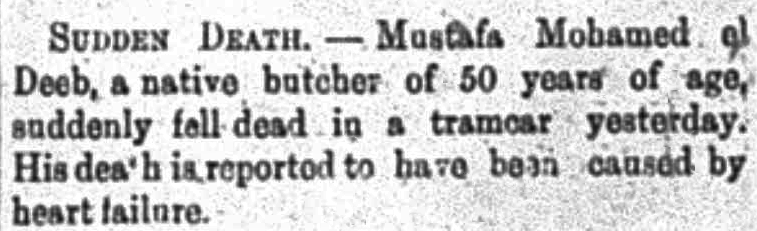

In the "Local and General" section of _The Egyptian Gazette_, different articles on death occur often. While others have researched the [plague](https://dig-eg-gaz.github.io/post/2016-11-06-cyr-bubonic-plague/) or [cholera](https://dig-eg-gaz.github.io/post/19-analysis-himmel/), I was intrigued by the term sudden death. The “Local and General” and “Personal and Social” sections of the _Egyptian Gazette_ mentions sudden death many times. Typically, the news reports about sudden deaths give information about a random person. This is an example from a 1905 issue of the _Egyptian Gazette_, “Mustafa Mohamed el Deep, a native butcher of 50 years of, suddenly fell dead in a tramcar yesterday. His death is reported to been caused by heart failure” (1905-10-12, “Sudden Death”). Historically, how much information did the medical community have in the early 1900s concerning sudden death? 

In 1908, Theodore Fisher, M.D., F.R.C.P. published a book titled [_The Heart and Sudden Death_](https://babel.hathitrust.org/cgi/pt?id=hvd.hc2dq8&view=1up&seq=9). This publication presents an abundance of information about the heart and heart diseases. The book describes aneurisms, alcoholism and the heart, and many more topics. 

Most of the stories in the _Egyptian Gazette_ that have a diagnosis fall into the category of heart failure, heart disease, or natural causes. Some other causes included ruptured aneurisms and apoplexy. The definition of apoplexy according to _A Dictionary of Medical Science_ published in 1903 is: “interstitial hemorrhage; effusion of blood occurring suddenly into the substance of an organ or tissue, as the brain, lung, etc.” This definition also makes clear that apoplexy is not cerebral hemorrhage which accounted for the cause of one of the deaths recorded in the _Egyptian Gazette_.  

Although the reports of sudden death in the _Egyptian Gazette_ seem slightly out of place to modern readers, it must have been important to the colonists then. Medical knowledge was expanding rapidly in the nineteenth and twentieth centuries, for example, in 1901 Karl Landsteiner discovered different blood types. At this point in time, physicians knew a great deal about the causes of heart disease although they knew little about how to prevent it.
