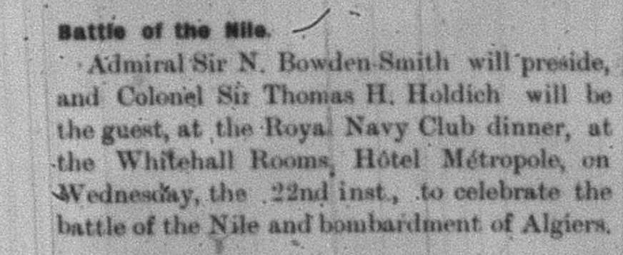

During the late 1700s in the month of August, the [Battle of the Nile](http://www.historyofwar.org/articles/battles_nile.html) came to an end. August 2, 1798 marked the day that the battle was won by the British Navy. This victory was so important to the British, as it secured their position in controlling the Mediterranean seas. Since this win was seen as such a prominent event, the [celebrations](https://www.rct.uk/collection/810503/admiral-nelson-recreating-with-his-brave-tars-after-the-glorious-battle-of-the) continued even years after it took place. This battle was just one among many, but was the specific event that ensured that the British overpowered the French. This fleet was led by Rear-Admiral Sir Horatio Nelson, who was recognized as a hero after this took place. This was his first admirable victory of three. Nelson is the one who made the decision to head directly to Alexandria, ultimately, causing them to be able to cut off the French fleet that was heading more towards the coast of Crete. Despite all the troubles he went through, he was able to observe their route and make a move to overtake them. Since this victory arose out of a time that seemed to have no hope, it was even more exciting to the British. This is why it was extremely celebrated after it occurred, especially as this was seen as Napoleon's first real defeat. 

[Holiday Celebrations](https://babel.hathitrust.org/cgi/pt?id=aeu.ark:/13960/t11n9db6p&view=1up&seq=18)

