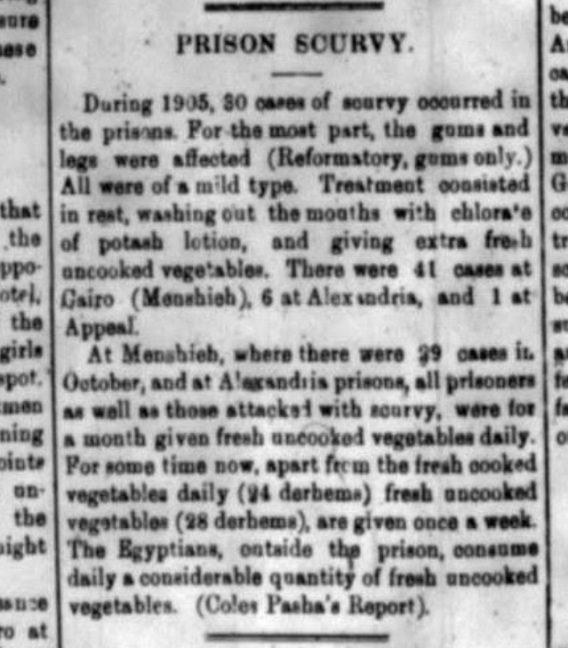

In Egypt, 30 cases of scurvy occurred in prisons. This interested me because nowadays, scurvy does not happen in prison even though some prisons don't serve the most nutritious of foods. This made me wonder how bad the food must have been in the prisons in terms of nutrition, Which led me to question how prisoners were being fed but got so little nutrition that they developed scurvy. From the sources I looked into, namely Rudolph Peters' _Triumphant Prison_(2002), Egypt had [a very developed prison system for its time](https://acjr.org.za/resource-centre/copy_of_Triumphant%20prison%20AnnIsl.pdf), however as [Rudolph Peters finds in his 2004 dive into Egyptian prison conditions](https://www.jstor.org/stable/3879881#metadata_info_tab_contents), he argues it was mainly focused on punishment rather than rehabilitation. I also found that despite having a pretty thoroughly developed legal system, there was a large emphasis on finding revenge rather than reaching a fair conclusion, often being used as justification for the horrible treatment of prisoners. When taking all this into consideration especially seeing [the state of law enforcement](https://dig-eg-gaz.github.io/post/2020-03-10-kennethhills/) as discussed in Kenneth Hills' analysis of Egyptian law enforcement, prisoners were most likely treated as second-class citizens. This makes me think that the prisoners that developed scurvy had most likely lost some sort of food privileges, such as fresh vegetables or other sources of Vitamin C. By the 1900's, the causes and prevention of scurvy were well known, so no one actually died from getting it, and the worst of the cases were mild. Overall, from my research with supporting information from Shaneze Douglas' analysis of execution of Egyptian law against foreigners, finds that prisons in Egypt were [far from the worst](https://dig-eg-gaz.github.io/post/2019-12-10-shanezedouglas/) that the world had, and the prisoners had medical care and some rights and were not left to die.

