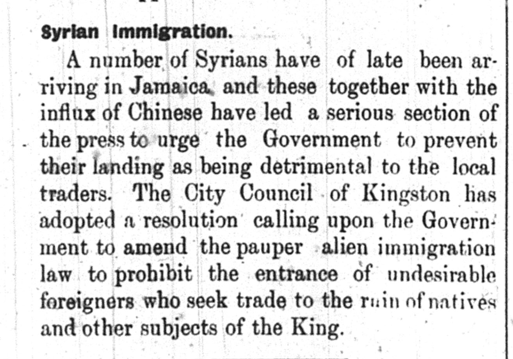
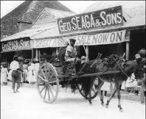

Within the issue of October 8, 1907 under the Local and General Section, an interesting deviation from the normalities of that column appeared. Within this small paragraph it is discussed that a heavier influx of Syrians, which could describe both people from what is known as modern day Syria or from the Levant as a while, along with Chinese migrants to Jamaica. This “oriental” influx seemingly pushed the Government of Jamaica to prevent their entrance into the country, as it would pose a threat to local traders in the region. From this the City Council of Kingston pushed to amend the pauper alien immigration law to hinder the landing of “undesirable foreigners” in what was portrayed as an act of economic self preservation for other natives. The mention of this phenomenon mirrors the overarching trends found within this period, as Levantine/Syrian migration abroad for work had started becoming a more integral facet of the Middle Eastern existence and economy. This also coincided with other Eastern communities, especially Japanese and Chinese, doing the same, hence the mention of the Chinese immigrant influx as well within this short text. This started creating a new world social schema, and the racially targeted legislation that is seen being discussed had and would start popping up in different countries within the Western Hemisphere. This curiosity offers a small window in the overarching migrational patterns that characterized that time.

## Sources
- Fahrenthold, Stacy D. [“Arab Labor Migration in the Americas, 1880–1930.”](https://doi.org/10.1093/acrefore/9780199329175.013.598.) _Oxford Research Encyclopedia of American History_ (2019). 
- Nicholls, David. ["No Hawkers and Pedlars: Arabs of the Antilles"](https://doi.org/10.1007/978-1-349-17786-8_9), in _Haiti in Caribbean Context_, St Antony’s Series (Palgrave Macmillan, 1985).
- Nicholls, David. ["The "Syrians" of Jamaica."](https://www.proquest.com/scholarly-journals/syrians-jamaica/docview/1292739482/se-2.) _Jamaican Historical Review_, vol. 15, 1986, pp. 50.