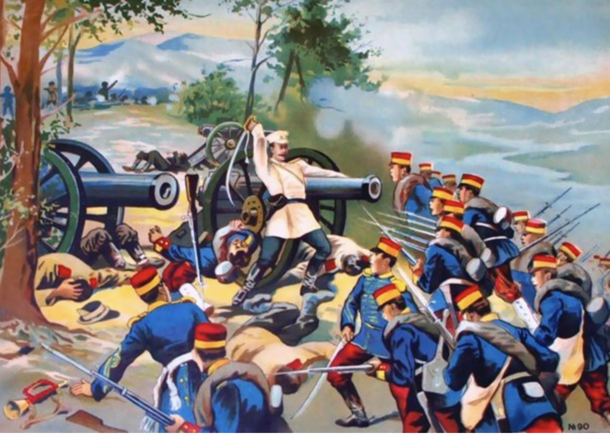

The image from my newspapers discusses advancements, rumors, and overall stories from the Russo-Japanese War, which took place from February 1904 to September 1905, and led to the first time a European power lost to a non-European Army, and established Japan as a military power leading to the increased militarization of Japanese society that had dwindled in years previous. The article discusses how Russian counterattacks were being repulsed, and that the Japanese were on the offensive and were succesfully taking over parts of Port Arthur. Eventually, the Japanese did take over Port Arthur, which allowed them to land more men into the mainland and take the fight to the Russians. At this point in time the Russians knew they needed help from through their alliances, so their agents throughout Europe, such as those in Hull, would try to make up reasons to get other countries involved in the war, such as bribing fisherman to say they saw torpedo-boats. This would most likely cause a country to join the war, which would help the Russians. Overall, the main tone of the sections is that the Japanese are overwhelmingly winning, and the Russians are on the backfoot. This could be caused because the British were closely allianced with Japan, and that is why the article does not mention the tremendous casualities the Japanese took to take Port Arthut when compared to the Russians.

