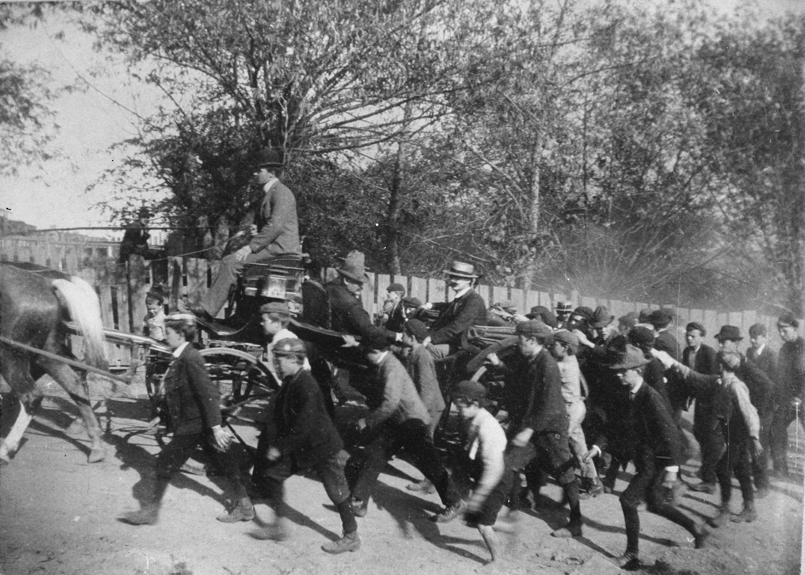
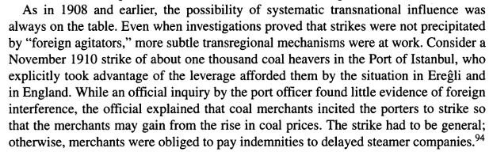

On December 5th 1904, a German collier, a ship carrying coal, stopped at Cardiff. The captain and the head member of the ship were arrested shortly after. Why is the Egyptian government now prohibiting the transporting and usage of coal? Is this just Egypt preventing the use of coal? Coal is not useful anymore?

Egyptian government officials watched their country become dirty, barren, and inhabitable as companies and industries became comfortable abusing coal to make energy. Coal was the primary source of energy for North African countries and cities across Europe for most of the century. Coal lit the homes of millions. However, after Thomas Edison proved that energy can be created via other more sustainable power sources, other countries wanted to implement similar mechanisms to help preserve their environment and prevent coal industries from gaining too much power.

 The public had enough as well with the rise of better work environments and laws. Coal miners with the worst of the environments to work in became enthralled and wanted revenge against the corporate suits running their lives. Strikes across Europe and North Africa became a weekly occurrence. According to an article titled “Outsourcing: Energy and Empire in the Age of Coal” from the Cambridge University Press, “As in 1908 and earlier, the possibility of systematic transnational influence was always on the table. Even when investigations proved that strikes were not precipitated by “foreign agitators,” more subtle transregional mechanisms were at work. Consider a November 1910 strike of about one thousand coal heavers in the Port of Istanbul, who explicitly took advantage of the leverage afforded them by the situation in Ereģli and in England”. Coal had become the forbidden fruit for energy production, and Egypt decided to avoid the possibility of strikes and carnage in the city of Cairo despite neighboring countries such as Germany sticking with it.
 
 Cameron Greco explores the prices changes and international feelings in her website entry posted back in April of 2017. "In January of 1905, coal prices were at 27.3 Shgs. per ton, and by the end of the recorded coal data, in September of 1906, the prices were at a steady level of 34 Shgs" states Cameron referring to the drastic increase in price of coal in Egypt. Coal was all the rage and all anyone could think about was producing more with little disregard for the environment. This pushed the workers past their limit causing strikes and prohibit of coal transportation in Egypt.

