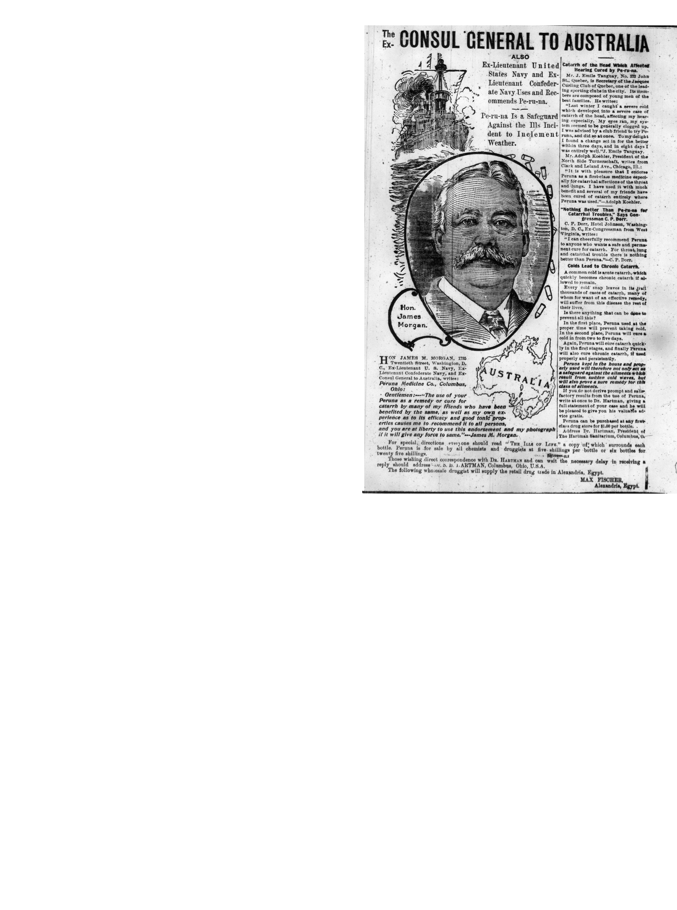

While browsing the Egyptian Gazette of December 3rd, 1904 I came across an interesting ad talking about an ex-Consul General of Australia and how he was promoting a new drug called “Pe-Ru-Na”. I took interest in this ad and proceeded to research this drug and its creator and came across many interesting facts about this apparent “wonder-drug”. 

Apparently it was branded as being able to cure Catarrh, which [NHS Inform](https://www.nhsinform.scot/illnesses-and-conditions/lungs-and-airways/catarrh) tells us is a buildup of mucus in an airway or cavity of the body. A previous post (["Miraculous Medicine"](https://dig-eg-gaz.github.io/post/2017-03-06-baxter-peruna/)) talks about another ad featuring a women suffereing from Catarrh for three years until Peruna cured it. We now know that this is a harmless condition that will eventually go away and is easily treated through things like saline nasal rinse, avoiding allergens, and staying well hydrated. However, these treatments were far less known back in the time of “Pe-Ru-Na” and so this “drug” was able to gain customers. As found in the [Ann Arbor District Library,](https://aadl.org/node/508575) all you needed to do was take a tablespoon of “Pe-Ru-Na” before each meal and when you go to sleep and Catarrh will go away perfectly. 

As I researched more into this “drug” I confirmed what I had begun to suspect, that “Pe-Ru-Na” was a scam and can be easily made by almost anyone. As stated in ["Pe-Ru-Na for Catarrh- The Great American Fraud,"](https://www.peachridgeglass.com/2018/10/pe-ru-na-for-catarrh-the-great-american-fraud/) "Any one wishing to make Peruna for home consumption may do so by mixing half a pint of cologne spirits, 190 proof, with a pint and a half of water, adding thereto a little cubebs for flavor and a little burned sugar for color.” In summary, “Pe-Ru-Na” was a drug scam that was run back in the early 1900’s that ended up just being common alcohol with a little extra mixed in. This scam became incredibly popular because of all of the ads about people proclaiming that Peruna "saved their lives", as can be seen in ["Advertising, Has anything Really Changed"](https://dig-eg-gaz.github.io/post/18-blog-majonica/). 

Despite the drug being a scam, it was far more welcomed in the United States. The US was in the middle of Prohibition, and Peruna could still be sold over the counter. As mentioned in [a fellow blog post about Pe-Ru-Na](https://dig-eg-gaz.github.io/post/2017-04-14-bolton-blog/) Peruna became so popular that people named their children after it, with the Southern Methodist University naming their school mascot Peruna. All together though I believe this to be a funny example of past scams that can be looked upon in retrospect while laughing.
