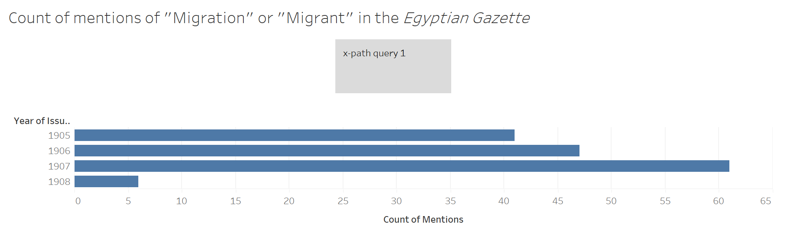
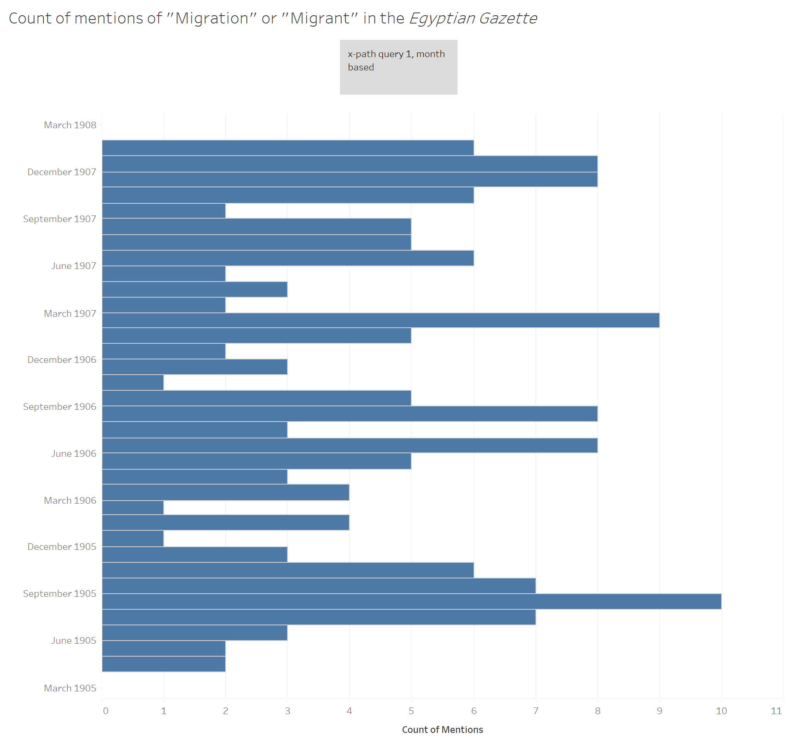
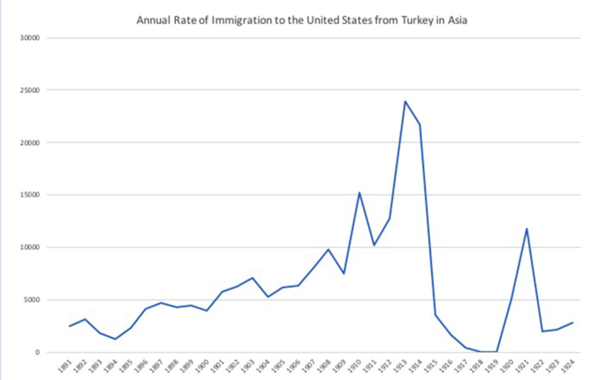

## Introduction and Historical Context
The Middle East and North Africa are regions particularly known for its different eras and patterns of shifting or displacing the locations of its populaces over the past centuries. In being this cross-section of trade and travel throughout the world, it is evident that this rich context would impact its future with both foreign involvement and foreign adventure. Within the late 18th and early 19th century, whether by economic strife, political oppression, religious persecution, or some other outlying factor, there was a new mass migratory movement from the Levantine Ottoman Empire. Between the years of 1880 and 1924 around a half million Levantine Arabs left their homelands to  obtain a sense of freedom economically, socially, and politically within the Americas, North, Central, and South (Fahrenthold). Recent economic forces had started to link the Mediterranean and Atlantic newly capitalistic economies, and in doing so created a labor vacuum that easily brought in these new Arab migrants (Fahrenthold). Egypt served as an integral part to this process in multiple ways, most principally being one of the major channels  through which Levantine migrants had to pass in order to begin their journey to the Americas (Hitti 62) or by the fact that first Arabic periodicals from the Americas appeared in Egypt which then spurred a strong network of global readership between the US, Latin America, and Egypt (Fahrenthold). It is evident that by more than proximity but rather direct involvement with this phenomenon lends it to be something that could be particularly interesting in Egyptian society, and through that perhaps of note within the _Egyptian Gazette_ itself. This analysis pursues this question, with the idea of the mention and opinion of Levantine migration found within the _Egyptian Gazette_.

## Topic Discussion
My overall question is the discussion and portrayal of Levantine migration within _Egyptian Gazette_, which was prompted by my coincidental finding of a small blurb about “Syrian Immigration to Jamaica” that I found in the local and general section of one of the editions I was encoding. This led to the curiosity of whether other forms of Levantine migration were mentioned, and if so, how often, where,why, and in what light. In essence this topic begets itself to be qualitative work and analysis, which contrasts to the more quantitative leaning of the class and project; however, I deem it reflective as to what Digital Humanities is as a whole, as DIH work is based in this cross-section of the qualitative and the quantitative as a form of computational history. This mindset imbued itself into my attitude towards the project directly affected my method in querying this topic.

## Querying Process, Visualizations, and Overall Findings 
My querying process used a combination of qualitative and quantitative approaches through my employment of multiple X-Paths. The more quantitative X-Path used was `count(//p[matches(., "migration", "i") or matches(., "migrant", "i")])` . I utilized this to gain a numerical look at how often these two words were mentioned to 1) dissect if there was a consistent pattern of repeated use during certain months or years and 2) to compare with a graph sourced from Kemal Karpat and utilized by Stacy Fahrenthold  that demonstrated the “Annual Rate of Immigration to the United States from Turkey in Asia” [the Levant] (Fahrenthold).. In comparing these two graphs I would be able to see if there is a correlation with higher immigration rates to higher mention rates within the __Egyptian Gazette__. The visualizations can be seen below:

In analyzing the three visualizations it is evident the rise of immigration from 1905-1908 is mirrored by the increasing reference of migration within the _Egyptian Gazette_, along with the simultaneous decrease in 1908. A weakness of this X-path/question is made apparent by the Karpat graph, in the sense that the database simply does not have the dates available where we see the highest peaks in immigration. Within this Xpath and the ones to discuss next, there was an issue with only getting a smaller number of hits than would be deemed useful or substantial. Especially for quantitative analysis, the limited range of hits impacts the substantialness of the data itself. However, if the mirroring trends made apparent with the current data set are accurate, then it could set the groundwork for predicting the use of migration in the _Egyptian Gazette_ in the future.

In my more qualitative exploits used and tested out a myriad of Xpaths which included:
- `//p[matches(., "immigration", "i") or matches(., "migrant", "i")]/parent::div/@feature`
- `//div[@feature="local" and matches(., "immigration",  "i")]`
- `//div[@feature="local" and matches(., "migration",  "i")]`
- `//p[matches(., “levant”, “i”) and matches(., 'Syrian', “i”)]`

After employing them, I would go through and read the results that came up since they rarely exceeded 200 items max. In doing so I would see the context in which the word was used and the connotation and description surrounding it to try to garner the opinion or viewpoint of the readers and contributors to the _Egyptian Gazette_ surrounding not only topics of migration but the community I am particularly focusing on: Levantine/Syrian. I made note of a dichotomy between the positive outlook towards migration from the Islamic Egyptian perspective and the negative connotation surrounding British based ideas on the matter. For the Egyptian perspective I found in part 5.4 of the 1906-02-14 edition emigration being described as being “useful”, “advisable”, and “being approved by the Prophet” but that also Egyptians must be very cognizant of where and when they emigrate so that they can ensure they have assured rights and privileges in the countries they migrate to. In comparison, a lot of mentions of migration or of Levantines/Syrians that seemed to come from British sources or directed and British audiences have a negative or degrading connotation around them. Across multiple issues they are described as ignorant, fickle, lacking a high standard of morality, etc, and a lot of policy is promoted or discussed surrounding the fact that their and other East Asian immigration to the West should be limited because of their background. This duality of perspectives reflect the overarching viewpoints on Levantine immigration by the East and West during that era, and so interestingly despite a low return rate of hits, the information made available provided a useful insight as to how the portrayal of such is reflected within the _Egyptian Gazette_. 

## Reflection on the Process and Implications for the _Gazette_
Overall, there is a lot more experimentation that could be done with different Xpath results to garner more data surrounding this topic, as so much experimentation was needed to get the limited data I had now . I believe the groundwork laid here can be used as a structural basis into which to analyze this topic once more editions of the _Gazette_ are digitally encoded, and that even more trends and relations between migrational patterns and mentions in the _Gazette_ can potentially be seen using the combo comparative quantitative methodology and qualitative digging demonstrated here. This project has spurred an acceptance within me that the work of a historian is never ending. 

## Additional sources:
- Fahrenthold, Stacy D. [“Arab Labor Migration in the Americas, 1880–1930.”](https://doi.org/10.1093/acrefore/9780199329175.013.598.) _Oxford Research Encyclopedia of American History_ (2019).
- Hitti, Philip. _The Syrians in America_ New York: George H. Doran Company.