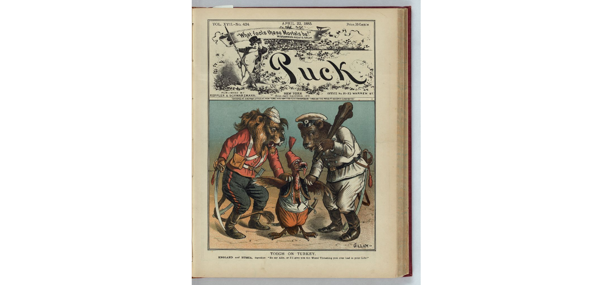
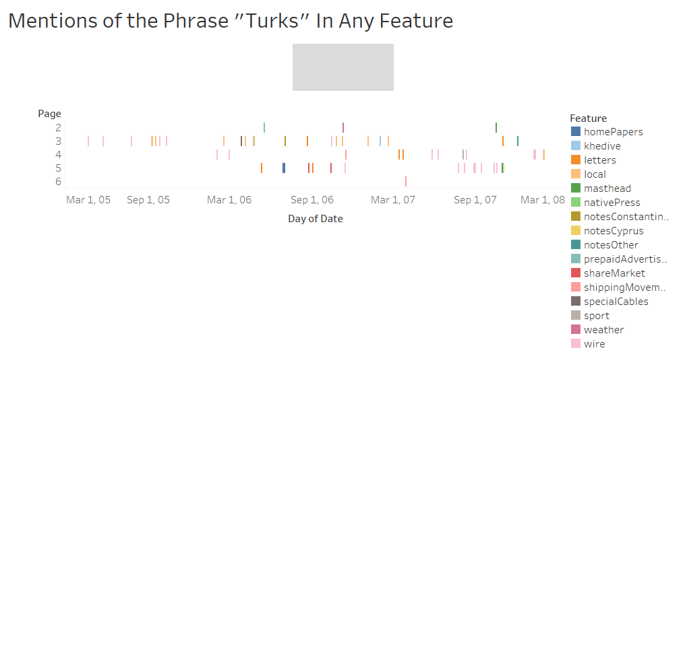

It was common knowledge in the late 19th century and early 20th century that the Ottoman Empire was weak in comparison to its Western European counterparts. What was once a vast, threatening force that conquered the last remnants of the Roman Empire and spanned across Africa was now a kind of joke to the great European powers. After all, France and Britain had to aid the Ottomans in warding off Russia in the Crimean War (1853-1856), and Britain was de facto occupying Ottoman Egypt from 1882 until the Empire itself collapsed and beyond. These events were major blows to the image of this once feared empire, and they led to the idea that it was powerless. This is shown in the political cartoon: Tough on Turkey, which depicts Russia as a bear and England as a lion bullying the Ottoman Empire, which is portrayed as a turkey. 

While this was the common interpretation of Turkey’s power in Britain, the British citizens that occupied Ottoman land would likely have a different relationship with the nation, being how they are in such close quarters with it. Thus, I look to find how the British living in Ottoman-controlled Egypt (practically in name only) viewed the Empire using the common phrases surrounding the word “Turks” within the Egyptian Gazette Digital Library.

Firstly, I looked to find how many times the phrase “Turks” showed up in any feature. I did this primarily because it was the search query for the group project, but I figured that this could still be useful just to show the amount of times it was mentioned. Note, I did not choose the phrase “Ottoman” because the amount of advertisements for Ottoman banks or bonds was absolutely enormous. I will get back to that further in this essay. Going back to the query, I used the phrase `//div[matches(.,'Turks', 'i')]/@feature`

As stated previously, this looked across all features of the newspaper that contained the word “Turks” within it. The “i” allows for the search to not be case sensitive. I plugged this query into the X-Path 2.0 feature in Oxygen to get fifty-eight (58) items throughout the contents. Here is a visualization of that spread, as done by Tableau:

As shown here, the phrase “Turks” is not present in advertisements (at least not much) since it appears in the later pages of the Gazette whenever it shows up. This allows for interpretation surrounding the phrases, as the paper is not being paid to print in the interest of Ottoman businesses. It also spans across the period of 1905-1907, thus it is generally a common occurrence (for the phrase only being used fifty-eight times anyways). It also falls under a wide range of topics as well under the Feature legend. Suffice to say, the Turks were on the minds of the British in Egypt relatively consistently, but what exactly are their thoughts?

Looking at the Egyptian Gazette, the answer is not entirely clear when querying these results. Much of the reporting on this topic is neutral, or at the very most just describing what the Turks did, or what happened to them, etc. One good example of this came from one of the earlier editions in 1905, in which it writes: “The Turks killed 30 Albanians in a fight near the town.” It has this but offers no opinion on it as it was just a story. Along with this, much of the way the text is written does not have much overarching ideas about the Turks. I found one example against that, but it is far and few between. This one writes about the Ottomans celebrating the anniversary of their Empire’s formation, with a royal prince discussing the “the sad situation in Turkey proper, owing to its bad government.” Overall, looking through this query one can find that the Turks (at least in that phraseology) is not discussed geo-politically much. However, there is more to this analysis. That being looking further into the phrase: “Ottoman”.

As previously stated, most of the mentions of the word “Ottoman” was found in advertisements. While there is the ability to eliminate advertisements in the query, many of them were listed as “items”, which eliminating those would make poor results. This could be seen as a limitation to this analysis, however, there is still information that could be taken from this issue. The fact that there are thousands of these advertisements shows that this Empire was important to the Brits in Egypt, otherwise there would not be so many of them if at all. One could make the argument that Ottoman business was seen as important to the occupiers. Therefore, through this lens I feel that the Ottomans/Turks were important to the British in Egypt overall, as they are in such close quarters with them that Ottoman business was a part of daily life.

Ultimately, I do believe that the British in Alexandria did regard the Ottoman Empire as important, or at least more important than Londoners, because they were living on Turkish soil. Through some implicit analysis, I think that one could easily come to this conclusion.

## Source
Gillam, Bernhard. “Tough on Turkey”. The Library of Congress, Puck, 22 April 1885, https://www.loc.gov/resource/ppmsca.28190/.