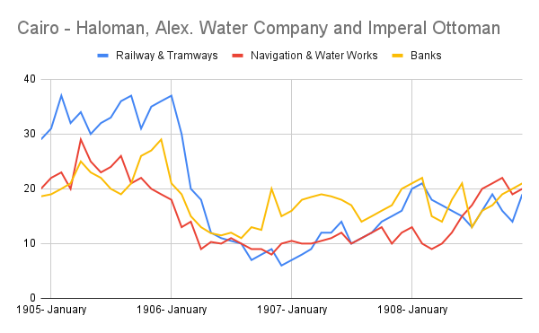

Black Monday 1987. The 2007-2008 Financial Crisis. Wall Street Crash of 1929. Financial
Crises go down in history as awful periods of time. Mass unemployment, smaller dinners,
starving times. Egypt fell into a recession in late 1906 - early 1907s, but how were different
markets of the Egypt economy affected by the crash? Can X-Path analysis tell us anything
about the origins and impact of the crash?

Using a series of cell-measure commands in X-path, I scanned the repository of
newspapers produced in Cairo in the 1900s to find the share price of three companies each in
different markets of the microeconomy. Record the share price each time they show up in the
issues and plot them to see the impact on each market specifically.

After importing the data into google sheets, I was able to produce the above chart. We can see
the share prices dip in the 1906-1907 due to the crash. However, the crash seems to be equally
devastating to each market of the microeconomy in Cairo, and most surprisingly, the banks are
the most stable throughout the crash despite the nature of stock market crashes attacking the
banks first due to loan squeezes.

Yet, when you look up the stock market crash of 1907 in egypt. Most of the searched
results are about the New York stock crisis in 1907 and not about the crash in the
microeconomy of Egypt/Cairo. Country economies are like gears in a system, when one stops
or slows down, others are bound to be affected. The same effect can be seen in the stock
crashes in both Egypt and the United States.

However, the data and specific results I retrieved from X-Path should be taken lightly due
to many errors and inconsistencies I found in the data.
