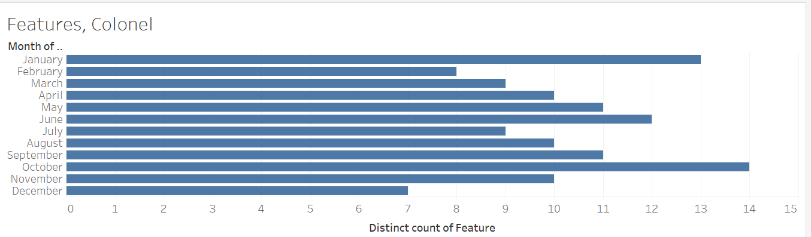
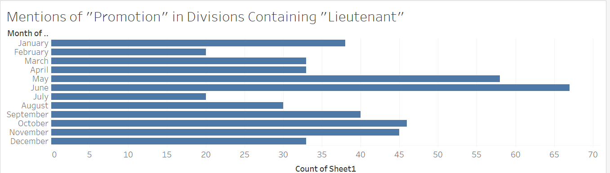

In 1882, the British Empire landed troops in Egypt with backing from the Khedive, and defeated the Egyptian nationalist military. However, the army was not there to completely take over the territory as with other colonial military operations of the time period. Instead, the occupying force was simply there to ensure that the European economic interests remained secure in a region of great diversity and political instability, with competing interests from the many European colonial empires, the Ottoman Empire from the west, and the native Egyptians. The nation of Egypt was left to be partially autonomous, but the Army of Occupation would remain to keep British interests safe and ensure that Britain's hold over the government would stay strong. 

My research seeks to analyze the promotions within this Army of Occupation, as the British military was a substantial part of the daily lives of the Egyptians under imperial subjugation, and the promotions within their ranks were the most commonly reoccuring feature in the Egyptian Gazette that pertains to this topic, and I took a research interest in it. 

In my initial stages of research, I used simple XPath queries to get a grasp on the basic data I would be working with. I wished to try to see if a pattern could be found, or if any of the initial data stood out for a path for my research to hone in on. I began with queries related to keywords, such as specific ranks and promotions.

- `//div[matches(.,'colonel', 'i')]/head`
- `//div[matches(.,'colonel', 'i')]/@feature`
- `//div[matches(.,'corporal', 'i')]/head`
- `//div[matches(.,'corporal', 'i')]/@feature`
- `//div[matches(.,'lieutenant', 'i')]/head`
- `//div[matches(.,'lieutenant', 'i')]/@feature`
- `//div[matches(.,'promoted', 'i')]/@feature`
- `//div[matches(.,'promoted', 'i')]`

I chose to have the headings yielded so I could easily see the main topic of each division, and I would be able to tell easily if an article was unrelated to my research and exclude it before compiling data. I chose to do a secondary query of each yielding the features, so that I could see from a broad perspective how clean my data was. If most of my features had to do with the military or government, I knew that the data was an accurate representation of what my research was looking for. 

I noticed a pattern in the months that the rank "colonel" appeared, and saw that it most often was mentioned in certain months, peaking in October with 14 mentions, then sloping off until rising again in January to 13 mentions, then decreasing again before jumping up to 12 mentions in June, then sloping off and the cycle begins again. This would indicate that military presence in the news is concentrated within certain times of the year, and thus military promotions would be expected to peak in the same time frames.

I wished to test this theory and narrowed my search to mentions of the words "promotion" and "promoted" within divisions containing the rank of "Lieutenant". Sure enough, mentions peaked in the same periods of time. This confirmed that promotions tended to be awarded to military officers during specific months, and then become less and less frequent until the next peak.

I believe that the concentration of military promotions in the army of occupation around these months is due to British army traditions centered around the same time periods. In my research I discovered that the honors, awards, and promotions to officers in the Royal Army were announced in The Gazette, the official public record of the United Kingdom, twice a year. The Gazette reports that after a Royal decree, "With these regular awards came the institution of the Birthday and New Year honours lists, published as supplements to The Gazette. Honours are published in The Gazette twice a year - between May and June on the Queen's official birthday, and at the New Year". This explains why the promotions would peak in January and June, as they do in the  Egyptian Gazette, as the British heirarchy would be incentivized to give out their intended promotions before they are announced and archived back in London. Also, an extremely popular military parade falls annually in mid-June, known as "Trooping the Colour", and it would make sense for promotions to be given around this event, as many senior officers and members of the royal family are present.

“National and Personal Achievements: Military and CI...” The Gazette, https://www.thegazette.co.uk/all-notices/content/national-record-of-achievement. 