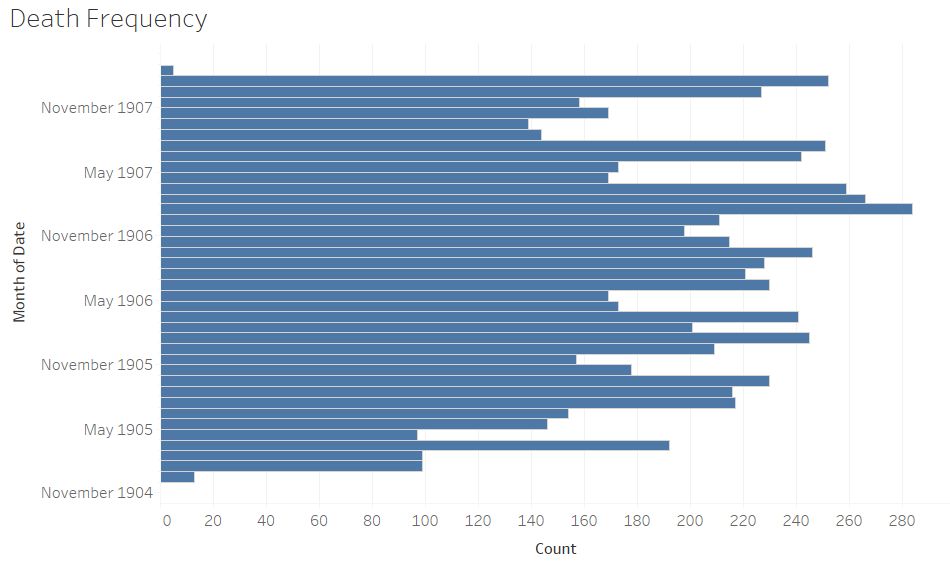
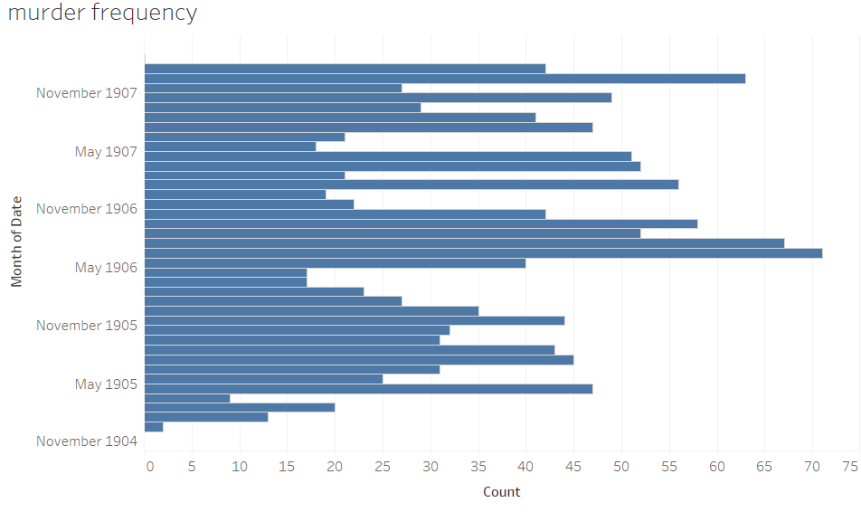
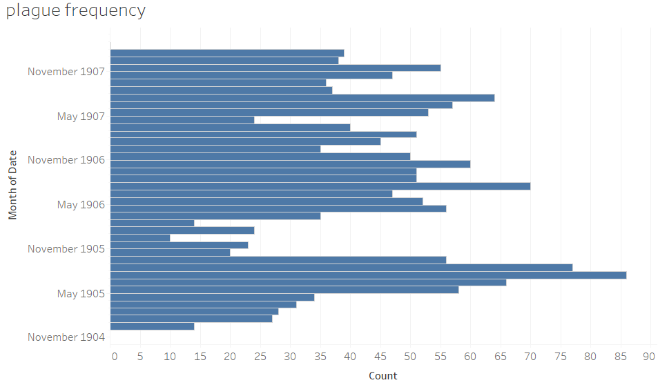
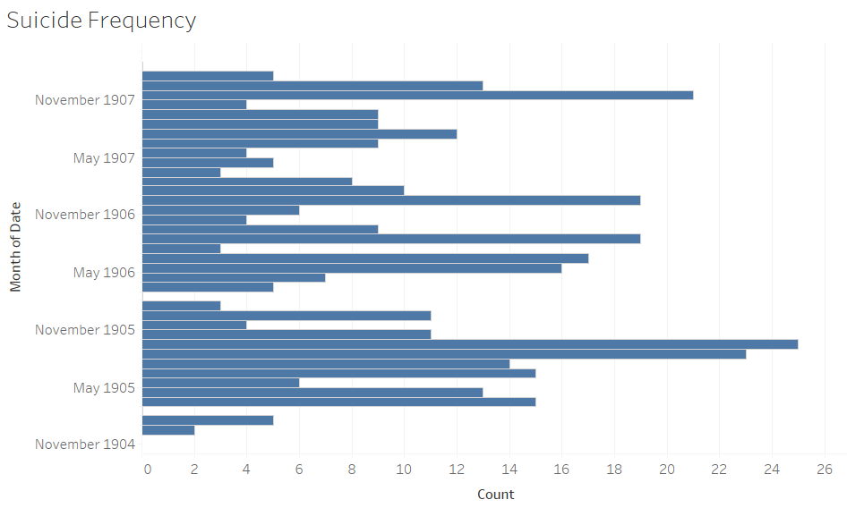
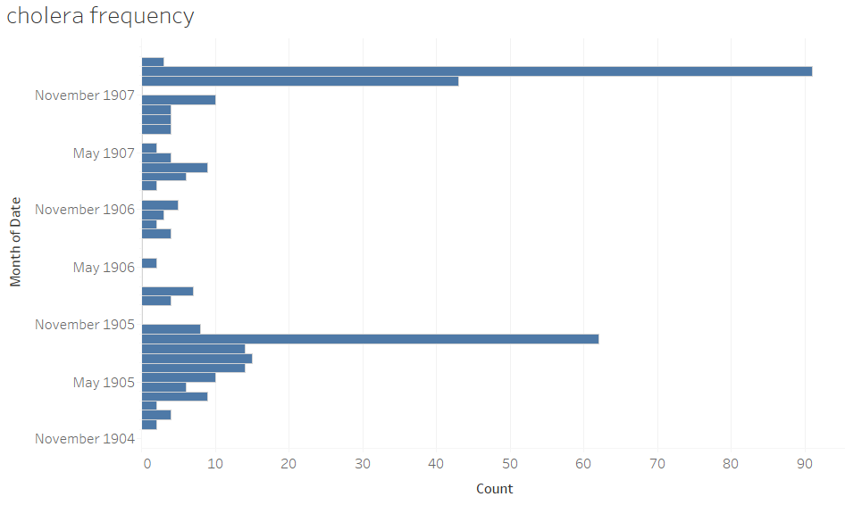

Death and its causes are widely reported in the _Egyptian Gazette_, however it is not reported equally at all times of the year. Knowing the months when death is most common allows for further analysis on what causes the death rate to change throughout the year. This can also be done with the various causes of death such as murder. This knowledge gives some insight into what it was like to live in Alexandria, Egypt in the early 1900s.

To answer the question of what causes the death rate to change throughout the year I first ran the x-path query `count(//div[matches(., 'dea[d,th]','i')])`. I also ran the same x-path query for murder, suicide, plague, and cholera because those where all common causes of death at the time. The first thing I noticed in the death rate is that it consistently rises from July through September before it drops then peaks in January. This increase in death during the summer months can be explained by looking at the rates for murder and plague, which both have higher rates during the summer months.

 According to [Nathan Wilson](https://www.natchitochestimes.com/2022/07/19/why-does-crime-increase-in-the-summer/), even in modern times the summer months are when crimes are at its peak, including violent crimes such as murder. One cause of this is that the temperatures are simply higher than they are at other times of the year. The belief is that the discomforting higher temperature “acts as a stressor and alters the brain’s chemistry”. This makes people irritable and prone to anger, which would naturally cause more people to commit murder in the heat of the moment. Egypt has longer daylight hours in the summer months than any other time of year. The longer daylight hours coupled with the elevated temperature cause people to have lower quality sleep than they would otherwise. This lower quality sleep has been linked to impulsivity and aggression, which can also cause people to commit murder in the heat of the moment.

An increase in the murder rate is not the only reason that the death rate rises in the summer. The amount of reported cases of the plague is also much higher around the same time that the death rate was increased.  According to [Tamara Ben-Ari et al.](https://www.ncbi.nlm.nih.gov/pmc/articles/PMC3174245/), there are many factors that affect rodent fleas. Some of these factors include ambient temperature, rainfall, and relative humidity. When there is warm and moist weather then there will likely be more fleas. Flea development also increases with temperature, until it reaches a certain point. If the temperature is too high and the humidity is too low then the survival rate for immature fleas will drop. This would explain the rates of the plague seen in The Egyptian Gazette because while the plague frequency is consistently higher in the summer, sometimes it seems to randomly drop prematurely. This is likely due to either the temperature rising too high or the humidity dropping too low, if not both.

The more difficult trend in the death rate is the peak that occurs in the winter months, despite the fact that both the murder rate and the plague frequency are usually lower in the same periods. The suicide rate is much more random that any other cause of death so it serves to explain some isolated months such as December 1906, but it does not explain why the death rate regularly peaks at this time. Similarly, the cases of cholera are low throughout the year, except for January 1908, which appears to have had an outbreak of sorts, which can explain the high death rate in that month, but nothing else.

It is likely that this heightened death frequency is from a plethora of causes as opposed to the increase in the summer, which is much easier to pinpoint.  According to [W. R. Keatinge](https://www.tandfonline.com/doi/pdf/10.3402/ijch.v61i4.17477), it is known that respiratory diseases are more common in the winter. This is because people tend to gather together inside to avoid the cold, which increases the chances for cross infection. On top of that it is also believed that winter temperatures cool the mucus in the upper respiratory tract. This essentially suppresses the immune system and makes it more difficult to fight infections. These two factors make death much more likely in the winter because people would be more vulnerable to a plethora of respiratory diseases and other diseases such as the flu.

There is another explanation for why the death rates would increase in this time period, but it would only apply to the audience for The Egyptian Gazette because they are more likely to be English than other people in Egypt at the time. Accoridng to [Mitsuru Shimizu and Brett Pelham](https://spsp.org/news-center/character-context-blog/breaking-date-grim-reaper-people-sometimes-postpone-their-death), people can essentially postpone their deaths for one last holiday. In this case it would likely be Christmas or New Years, which is why this would only apply to the English-Egyptians because they are more likely to be Christians. The authors believe that this death deferral effect is that people make conscious decisions to survive for one last major holiday. While this explanation certainly contributes to the elevated death rate in the winter, the primary cause is likely to be increased disease due to a suppressed immune system.

While these results make a decent amount of sense and are consistent with what can be observed today, it is worth keeping in mind that not all issues of The Egyptian Gazette have been accurately uploaded to the website. Also it is likely that these words appeared in areas besides where they are being reported. They would also be used multiple times in reports so the counts for death, murder, plague, suicide, and cholera won’t be completely accurate. With that said, these results are still useful for providing some insight into when death was most common in Alexandria, Egypt and what exactly caused this to be the case.
