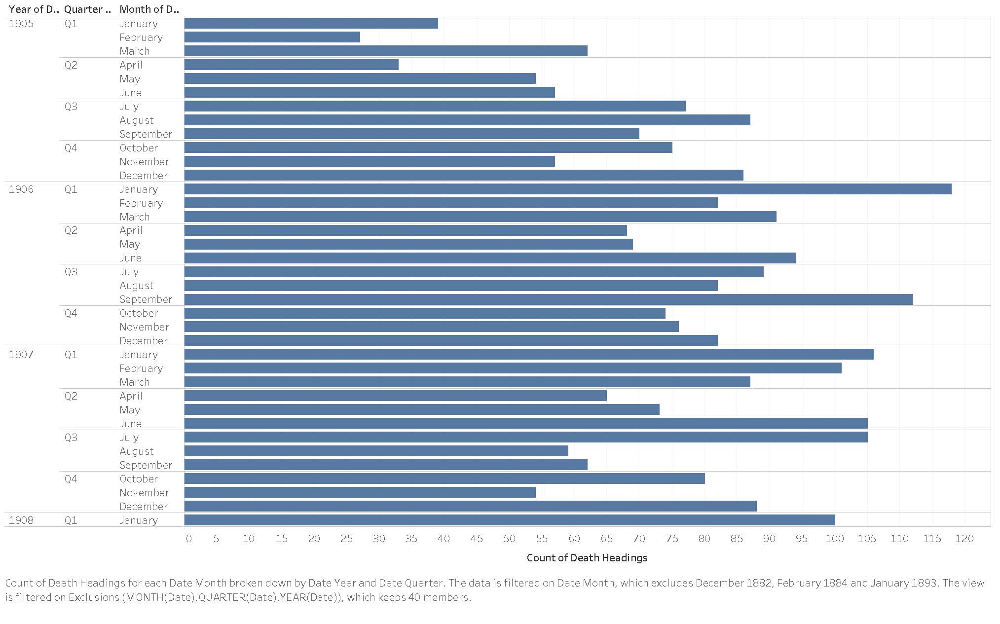
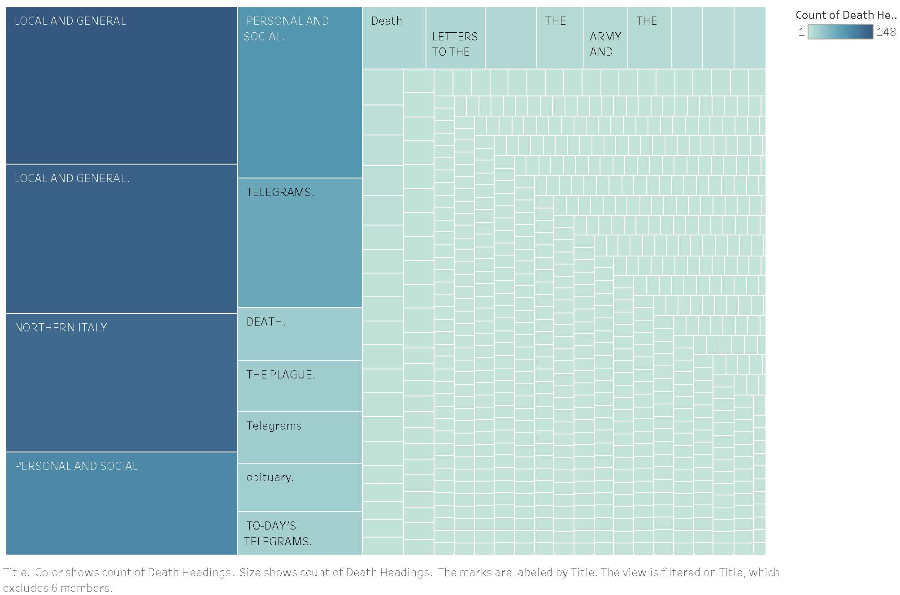
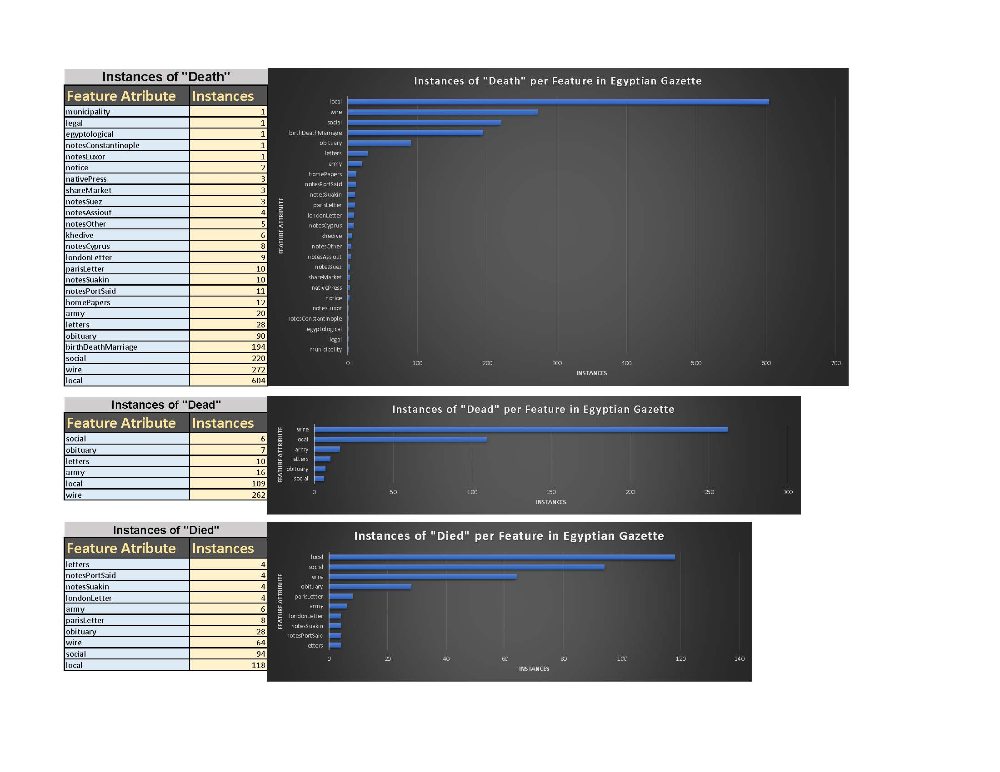
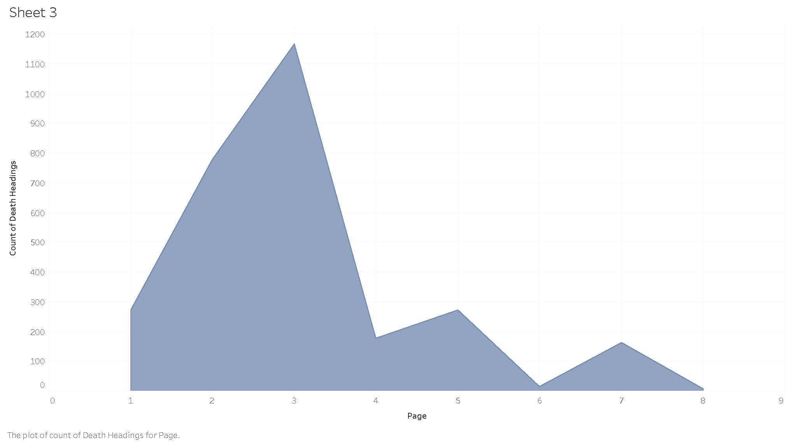
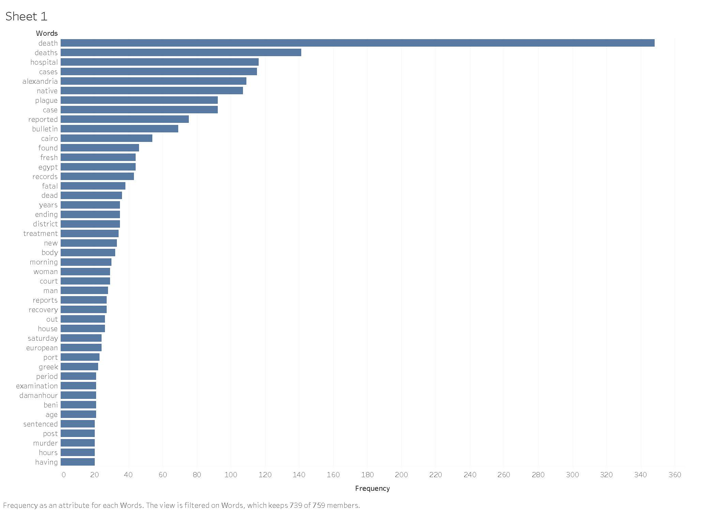

Our group decided to focus on death reports throughout the Digital _Egyptian Gazette_. Since this topic has already been thoroughly examined by other students in the past, we had to find something that would add new insight to how the _Gazette_ reported upon deaths in the early 1900's. As a result, we decided to study the various components of life in Egypt that affected death and its subsequent presence in the _Egyptian Gazette_ as reports, articles, and expositions. We also researched how violent crime is reported in the _Egyptian Gazette_ in comparison to murder. Throughout various research methods, we discovered that death was one of the most prevalent topics of conversation in the _Egyptian Gazette_.

Death is something that is very often reported throughout the _Gazette_, with multiple cases reported per day. Going through thousands of results for the words "death" and "dead" would be a hard task in order to find trends and useful insight to how the British in Alexandria spoke on death in the early 1900's. However, we still started with a very broad query search to get a basic idea of the organization of death reports throughout the newspaper. We used X-Path to search for all the headings of `div`s that contained the words “dead” and “death”, without paying attention to whether the words were uppercase or lowercase, by searching `//body/div/div[(matches(.,’dea[d,th]’,’i’))]/head`. 

This gave us a search result of 3458 items, which we then used regular expression in Sublime Text to just keep the dates, headings, and page numbers of our results. After this, we organized the results into excel, proceeding to use Tableau to create visualizations of Death Headings throughout the _Gazette_. We were able to organize the data with a bar graph to show the frequency of death reports per month, quarter, and year. This gave us a basic idea of which seasons deaths occurred the most in, which could be significant in understanding life in Alexandria during the early 20th century. 

From this visualization, we clearly saw that deaths most often occurred in peak winter and summer months, with January 1906 having the greatest number of occurrences of death. According to the [Judicial Adviser Report](https://www.dropbox.com/sh/xa8w9338b7yoyow/AADjpeAbqmqfe3_5PYE4dpdja?dl=0&preview=Judicial-adviser-1904.pdf) from 1904 written by the British Judicial Adviser, death was most frequently caused by vengeance and cupidity. These months often lead to an increase in social interaction, which therefore caused an increase in feelings of greed and retribution. As a result, death sharply increased.
   

Another way we were able to visualize the data of all dead headings throughout the repository was by finding which headings death was most often reported under. We completed this by using a tree-map to show the most often used headings. Through this visualization, it was revealed that the “Local and General” heading was most often used by far; there were almost 300 results under this heading. The next largest headings were “Northern Italy,” “Personal and Social,” “Telegrams,” “Death,” “The Plague,” “Obituary,” and “Death”. This type of visualization was helpful in allowing us to identify the basic structure of where deaths are reported in the _Gazette_.
   

We also investigated the features that most often featured the words “Death,” “Dead,” and “Died”. The X-Path query we used for this was `//div[matches(.,’death’,’i’)]/@feature`, once again adding the “i” to ignore the case of the word, then changed the word inside the apostrophes to “dead” then “died”, going through every div to find the features that included these words. I did this in a slightly more tedious way that I could’ve done, but I got separate results for each word, which showed the frequency of the words in each feature. My results showed that the features “local,” “wire,” “social,” “birthDeathMarriage,” “obituary,” and “army” had the largest amount of death reports in them.  
   

The final visualization we made to help us understand the headings of death was a comparison between the count of death headings and the page number that they occurred on. This visualization showed us that death occurred on every single page, but was much more frequently reported on Page 3, which had 1,167 reports of death; around 10 times more than any other page. This makes sense since the 3rd page most often reports telegrams, local and general, and personal and social sections. These were some of the sections that had the most frequent reports of death. 
   

With all this information about the layout of death reports in the _Egyptian Gazette_, I wanted to find some additional insight to death reports that would help me understand more about the reports themselves, rather than just the layout of the reports. I figured that looking into the language used when describing these deaths would be very beneficial in broadening our understanding the way that the British in Egypt talked about death. In order to do this, I decided to use a simpler to find more words in the divs surrounding the word “death”. I did this by using the X-Path query `//div[@type=“section”]/div/p[contains(.,’death’)]` to find the divs with the word “death” in them, which produced around 350 results, then followed the same procedure of using Sublime Text, and then using Excel to section the data into 2 columns of dates and words. However, instead of going straight to Tableau afterwards, I used the Online Word Counter linked in the resources tab of the Digital _Egyptian Gazette_ page. After pasting all my results in, excluding the dates of each report, the word counter generated a list of the most frequent words used in my data. I then created another Excel sheet with only this information and connected it to Tableau, creating a bar graph visualization of the most frequently used words around the descriptions of deaths. 

Discarding the unimportant words, which mostly happened to be numbers such as “one” and “two”, along with some extra words that didn’t provide any insight into the language around death, I found that the visualization provided a good data set of words. Predictably, the top two most common words found were “death” and “deaths.” Nevertheless, looking further down the bar graph we found that the most frequent deaths involved topics such as hospitals, Alexandria, native, plague, Cairo, Egypt, fatal, treatment, and many other words. This proved to be incredibly insightful, as it not only allowed me to see the words used to describe death, but it also showed me which types of deaths were more frequent than others, or which the _Gazette_ prioritized. 

For instance, hospital deaths were by far the most frequent, with a frequency of 116. This may ironically be because of the improvements to the healthcare system in Egypt during the 19th century, which would cause more people to rely on the hospitals. According to [Asakal and Hutt](https://dash.harvard.edu/bitstream/handle/1/10015270/Aksakal.pdf?sequence=1&isAllowed=y) the “medical schools, hospitals, pharmacies, sanitation systems, and inspection regimes” are similar to the public health institutions and systems that are used in modern times as well. While the developments were ahead of their time, they had the problem of constantly being short of resources. This prevented the reforms from being good as they could have been. This improvement in the medical systems could have increased the confidence the public had in the medical systems, which would have increased the number of people that went to hospitals. The lack of resources would have made their treatment more difficult, resulting in a large proportion of deaths in Egypt being hospital deaths. 

I also found that native deaths were very commonly reported, with a frequency of 107. This seems important since it could possibly show the contrasting conditions between native Egyptians lives and European lives in Alexandria. The plague was also a large factor of deaths reported, which most likely tie into the hospital deaths as well. The visualization revealed that the gender ratio of deaths was nearly the same; “woman” was used 29 times and “man” was used 28 times out of the death reports I gathered. This highlighted that there is not much bias or difference in frequency between the deaths of women versus deaths of men throughout the _Gazette_.  

Going down the graph, the frequency of words slowly decreases, yet a lot of descriptive words such as “European,” “Greek,” and “murder” were used around 20 times each. This once again gives a better understanding of which types of deaths most often occurred or were reported on. There was a small amount of children deaths, with a frequency of 15, and many more descriptive words that had a frequency of around 10. The list of words goes down to a frequency of 2, but I only captured the top of the bar graph to capture the most important or most frequent language that surrounded death reports in the _Egyptian Gazette_.