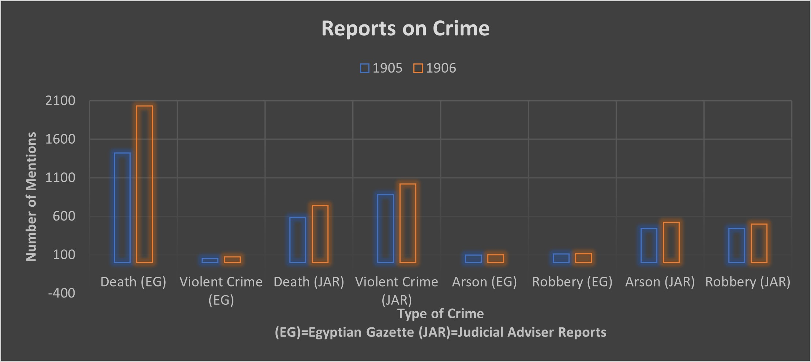

Crime in Alexandria has always been a topic of discussion among the people that call it home and in the newspapers that those people read. Throughout studying The Egyptian Gazette, there are recurring themes regarding the improvement and deterioration of crime in Alexandria. Throughout the early 1900s, the frequency of crime varied extremely, as the people of Alexandria experienced new things every year.

As with any society throughout history, crime was a very common theme among society. Through scouring the Judicial Adviser Reports [Judicial Adviser Report](https://www.dropbox.com/sh/xa8w9338b7yoyow/AADjpeAbqmqfe3_5PYE4dpdja?dl=0&preview=Judicial-adviser-1905.pdf), I found that there were about 2000 crimes a year. As said before though, the crimes that most interested me were those of violence and occasionally a resulting death. 

Throughout the Egyptian Gazette death is reported on regularly. I used an X-Path to search for all the headings of `div`s that contained the words “dead” and “death.” This query paid no regard to whether the words were lowercase or uppercase, by searching `//body/div/div[(matches(.,’dea[d,th]’,’i’))]/head`. This search gave me 3456 returns from throughout the newspaper. Through doing this research, I found that although death was constantly reported on, not all the results were death involving murder or violent crime. There were a vast majority of other hits that came back regarding death from other means such as suicide and sickness. Throughout the Egyptian Gazette, violent crime was also customarily reported on. Through using the X-path, `//div[matches(.,’violent crime’,’i’)]/@feature`, I found that violent crime was reported on not nearly as much as death. Just as death encompasses a lot of facets outside of murder, such as suicide, sickness, and natural death, violent crime has a lot of things to report on as well. Among these crimes were vicious acts such as arson, robbery, and assault. This leads to a massive number of reports for death, murder, and violent crime. Through more searching within the entire content repository, using xpaths searching for key words such as “arson” and “robbery,” I was able to narrow down my results regarding violent crime even more. Arson was reported on about as much as robbery, and the sum of the two of them was more than the quantity in which violent crime was reported on. I think that this is because although “violent crime,” seems like a broad search term, that it just is not mentioned as much as the specific crimes themselves.

As you can see from the above data visualization, the actual types of violent crime are reported a lot more than violent crime itself. In the Egyptian gazette, the actual crime is reported a lot less frequently than it is accounted for in the judicial adviser reports written by the government. I think that this could be for various reasons. The main reason in which I think that crime and death is not reported as frequently as it is actually committed is because the newspaper tries to maintain a positive tone and mood. On the contrary though, I think that the newspaper should also be reporting events like these to keep the people of Egypt updated and informed on what is going on among them. As you can see in the data visualization, there is also a major discrepancy between the frequency in which violent crime in general is reported in the Egyptian Gazette than in the Judicial Adviser Reports. The coverage of crime in the Egyptian Gazette is not nearly as proportionately covered as it should be.  According to [The British in Egypt. Community, Crime and Crises, 1882–1922](https://www.tandfonline.com/doi/full/10.1080/00263206.2012.691744?casa_token=bRmCaRubK1oAAAAA:hwMHaKLC-4C1WzzlHSIMMxWfOdFthLVUmSBq8_mb4bAGV3xF7lZb_LiXRZIx7Vg8fxaJNP6y4V0rBw) by Saul Kelly, there was also just far more material on the ruling elite than the common folk. As a result, most crime was committed by the common folk so although it was accounted for in the Judicial Adviser reports it was not reported on as much. This is what I also think lead to less crime being actually reported in the newspapers than was being committed. No one wants to read about the "average joe" or "common folk" guy next door getting killed or robbed, they like to hear about the elites getting themselves into trouble which occured much less frequently. 

Many factors also contribute to the increase or decrease of crime that transcend people’s free will to do as they please. In the years that farmland was uncultivated, there was always an increase in theft and robbery due to a subsequent increase in poverty and desperation for sustenance. As the people of Egypt got more desperate and there was more unrest, the murder rates also increased. Whether it was an increase in land disputes because of fiscal hardship or a lack of prevention by public security, murder and crime, unrest ran rampant. 
