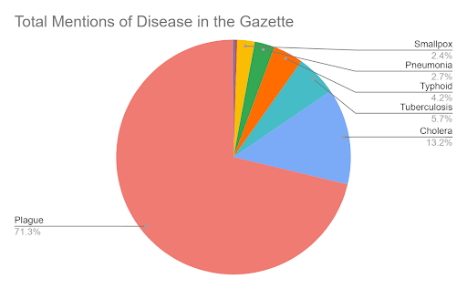

As in all newspapers, The Egyptian Gazette is no stranger to reporting on disease cases. From 1905-1907, the Gazette mentions various diseases 1,688 times. Despite this large figure, the specific breakdown of which diseases are mentioned more often than others reveals a vast inequality in the amount of mentions per disease. To gather this data, I performed several Xpath queries to determine the number of mentions of different diseases in the Gazette, both in total and over time.

`//div[matches(.,’plague’, ‘i’)]`
`//div[matches(.,’bilharzia’, ‘i’)]`
`//div[matches(.,’pneumonia’, ‘i’)]`
`//div[matches(.,’small pox’, ‘i’)]`
`//div[matches(.,’tuberculosis’, ‘i’)]`
`//div[matches(.,’cholera’, ‘i’)]`

This contrast in mentions is immediately obvious upon viewing the data, and raises several questions of why the Gazette chose its content in this way. This analysis will attempt to explain these disparities in context of when the Gazette was written, and who it was written for.

Founded in 1880, the Egyptian Gazette was a newspaper written by British citizens who had moved to Egypt. Early on, it “became the mouthpiece for British policy in Egypt” and was heavily monitored by Lord Cromer, the British Controller-General (Carcanague). Cromer had a large role in the control of the Gazette, and it is suspected that he personally subsidized the Gazette. As Controller-General, Cromer was responsible for the administration of Egypt while under British control from 1883-1907 (Lockman). All this to say that the Egyptian Gazette was a distinctly British entity, written by the British, for the British, and containing British opinions. The reason why this is important is that the motivations of the authors of the Gazette are directly related to their audience: British subjects. As emphasized in journalism, one of the key hallmarks of success in the news industry is to know your audience, and write about issues that they have an interest in (Santiago). In the case of the Gazette, this means that they were tasked with writing about issues that their fellow British subjects in Egypt were interested in, all while keeping in line with Cromer’s interests.

The importance of the audience of the Gazette is crucial to understanding the disparities between which diseases they featured in their issues. Since it was written for British citizens, one can assume that they tended to focus on diseases that tended to impact that population the most. This assumption is not made blindly; it is supported by a comparison of the disease mentions to actual cases during this time period. One of the largest cases of the gap between cases and coverage pertains to the disease Bizharthia. In her chapter analysis “Cruel Summer,” historian Jennifer Durr provides an account focusing on the prevalence of parasitic diseases, and how new methods of agriculture caused them to become quite common in society (Durr). One of the principal diseases caused by these parasites was schistosomiasis, or as it was referred to in the 1900s, Bizharthia. One of the key takeaways from Durr is just how widespread these parasites were in Egypt in this time period, with her stating that the “majority of the populations with regions with access to perennial irrigation” were afflicted. This issue was not something unknown to wider Egypt either; as early as 1838, Italian physician Angelo Dubini identified parasitic worms in the autopsies of Egyptians. These discoveries eventually morphed into scientific investigations of this issue as the 1800s progressed, even getting attention from the Sanitary Department. Durr’s analysis establishes two facts critical to the disparities in attention of diseases: Bizharthia was very widespread during this time period and it had been identified as a disease decades prior. Because of these facts, one might wonder why Bizharthia is only mentioned in the Gazette a measly four times over the course of 1905-1907 as revealed by an Xpath query. A potential answer to this issue relates back to the audience of the Gazette. While Bizharthia was extremely widespread, it was primarily found among Egyptian agricultural workers spending their time in wet, irrigated fields where the parasites easily spread. Since we have already established that the audience of the Gazette would not have been these workers, it stands to reason that it was neglected due to being seen as an Egyptian problem. Compare the 4 mentions of Bizharthia to the 1,270 mentions of the plague. Being that the disease killed ⅓ of Europe in the 1300s, all Europeans were quite familiar with the risk of the plague and the knowledge that it was highly contagious. While it certainly did see a high case number during this period, Bizharthia did as well, and yet received 318% fewer mentions. This suggests that the audience of the Gazette had a much higher interest in reading about plague than bizharthia. Therefore, the context of the Gazette’s author and audience could have quite plausibly played into what content they chose to focus on.

An additional investigation I conducted was to analyze the mentions of different diseases restricted to advertisements. I chose advertisements because they reflect public consumption and which issues are being emphasized by both consumers and suppliers. The XPath query for this question restricted the results to those labeled as “advert” 

This revealed the following:
`//div[@type="advert"][contains(., 'typhoid')]`
`//div[@type="advert"][contains(., 'smallpox')]`
`//div[@type="advert"][contains(., 'small pox')]`
`//div[@type="advert"][contains(., 'pneumonia')]`
`//div[@type="advert"][contains(., 'plague')]`
`//div[@type="advert"][contains(., 'bilharzia)]`
`//div[@type="advert"][contains(., 'tuberculosis')]`

Interestingly enough, despite having far fewer total mentions than several other diseases, tuberculosis had the most mentions in the advertisement section. These results could have resulted from many factors, including poor knowledge of medicine at the time. However, the 0 mentions of Bilharzia echo Bilharzia’s few overall mentions and add to the idea that it was neglected by the Gazette. 

## Works Cited:

Carcanague, Marc. Death at Denshawai: a Case Study in the History of British Imperialism in Egypt. 2020. Capstone.

Durr, Jennifer. The Lived Nile: Environment, Disease, and Material Colonial Economy in Egypt. Stanford University Press, 2019.

Lockman, Zachary. "Lord Cromer: Victorian Imperialist, Edwardian Proconsul." The Center for Middle Eastern Studies Harvard University, 23 May 2006, cmes.fas.harvard.edu/news/lord-cromer-victorian-imperialist-edwardian-proconsul.

Santiago, Anthony. "Why Knowing Your Audience is Important for Your Press Release." Newswire, 4 Mar. 2019, www.newswire.com/blog/why-knowing-your-audience-is-important-for-your-press-release.