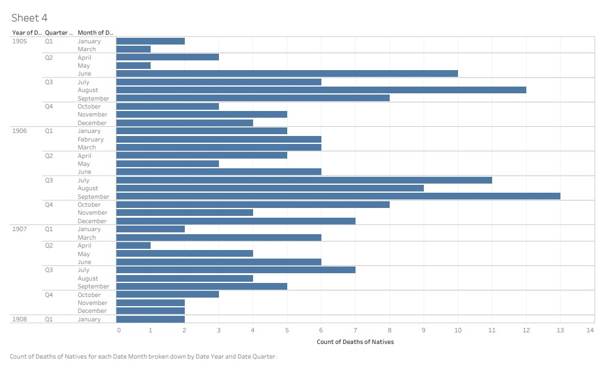
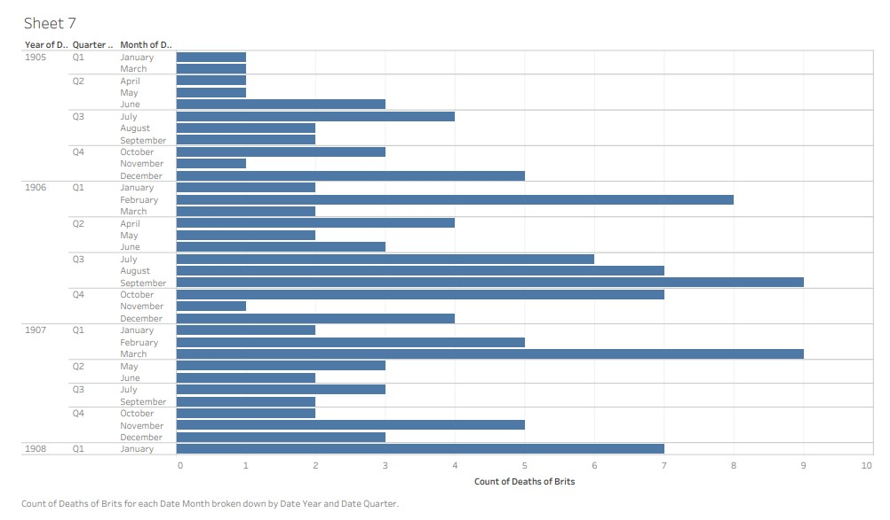
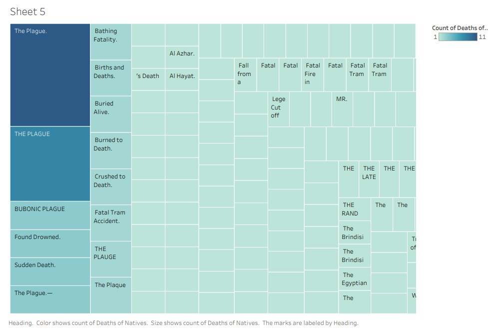
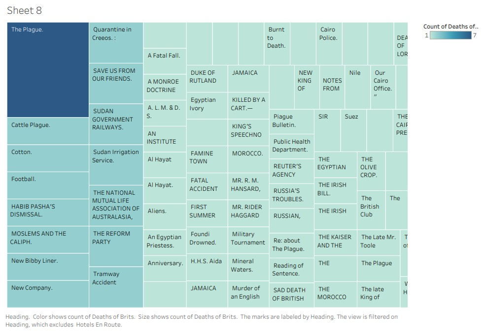
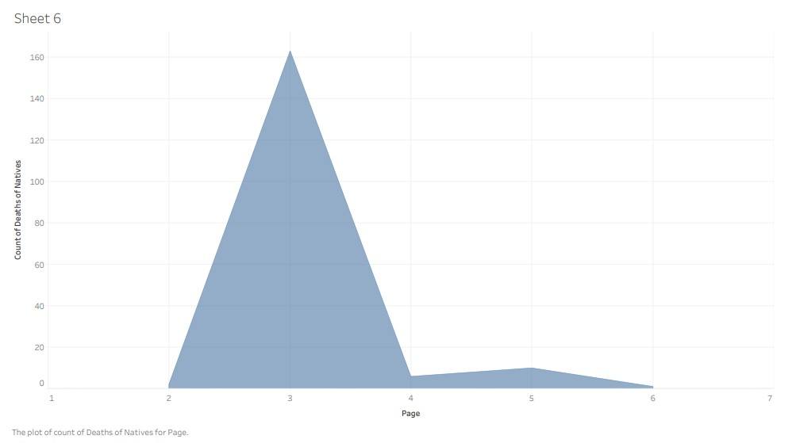
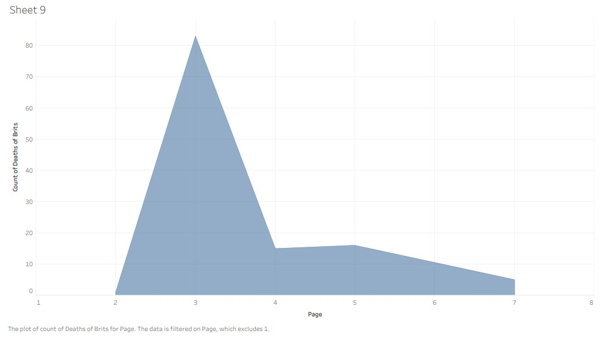
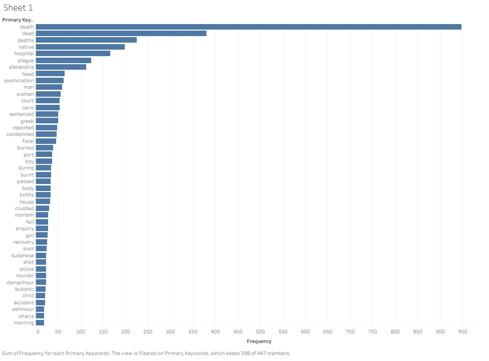

For my project, I decided to stem off my group project concept of deaths in the _Egyptian Gazette_ and focused solely on the comparison of Native Egyptian death reports versus European death reports throughout the newspaper.  I chose to investigate this topic because I thought it would be interesting to see the attitudes of the British towards the natives through death reports and compare those attitudes with those towards Europeans and other British people. I had a very minimal previous knowledge of tensions between the natives and the British, because of British colonialism in Egypt, but I wanted to learn more about it and see if these tensions were reflected in the _Egyptian Gazette_. I also wanted to compare the number of deaths reported for natives and Europeans, in hopes of seeing if there was a drastic difference within the number of deaths of each, or to see if there was bias in reporting deaths of either group when compared with real statistics of deaths in Alexandria.  

At first, I only focused on comparing the layout of native deaths and British/English deaths. I did this by completing 3 queries: 

- `//div/div/div[(matches(.,’dea[d,th]’,’i’)) and (matches(.,’native’,’i’))]/head` 

- `//div/div/div[(matches(.,’dea[d,th]’,’i’)) and (matches(.,’british’,’i’))]/head` 

- `//div/div/div[(matches(.,’dea[d,th]’,’i’)) and (matches(.,’english’,’i’))]/head` 

The first query allowed me to find the headings of all divs that had both “death” and “native” in them, while the second and third allowed me to do the same while searching for “British” and “english” alongside “death”. I included both “english” and “British” in order to get as many relevant results as possible by using different ways of describing one group of people. I tried doing this with native deaths as well by searching “Egyptian”, but the majority of results were irrelevant since the word “Egyptian” comes up countless times throughout the _Egyptian Gazette_. 

For my search of native deaths, I got around 180 results, while for the search of English/British deaths I got 150 results. I was able to visualize the data into 3 different charts. For the first chart, I made 2 separate bar graphs that showed the count of native and English deaths per month, quarter, and year. For the native death reports, a drastic majority occurred within the summer months, while for the English death reports, the death rate was highest in both the summer and winter months.  

The second visualization I made was a tree map that highlighted the most commonly used headlines when reporting native and British deaths. Both charts showed “The Plague” headline to make up for most of the death reports, however native deaths had more than double the amount of plague death reports than British deaths. Furthermore, when looking at the general descriptions of headlines, it was obvious to me that the native death headlines were often much more gruesome and tragic than the British death headlines. 

Chapter 5 of [*The Third Pandemic of Plague in Egypt*](https://babel.hathitrust.org/cgi/pt?id=mdp.39015070450344&view=1up&seq=145&q1=alexandria) highlights how Alexandria was a particularly easy city to get infected by the plague, because of its “crowded population, of middle class and poor people, living under bad housing conditions.” The plague had a case mortality rate of around 50% during the early 1900’s and every year had multiple cases of plague appearance between 1899-1930. This source also depicts which quarters in Alexandria had the most cases of plague, with Labban, one of the most infected areas, being inhabited by poor Egyptians and poor and middle-class Greeks, Maltese, and Italians. The least infected cities – Ramleh, Attarin, and Gomrok – contain modern European establishments and house the upper-class Alexandrians. This gives insight into why the plague was such a huge factor of deaths in Alexandria and why natives experienced a much greater number of deaths from the plague. 

 

The final visualization that I made from this search was a chart to show the frequency of death reports per page. I found that the charts for both nationalities were very similar, in that they both dramatically peaked at Page 3. However, my search for English death reports generated a lot more results in pages 4-7 than my search for native deaths did. I found this curious, but it makes sense since in the 8-page issues of the _Gazette_, the Army and Navy section often appears on page 4, which I would assume mostly consists of British soldiers. Additionally, the Local and General section along with the Native Press section would report on most native Egyptian deaths, which are both on page 3, and not many Egyptian deaths are reported outside that section. 

Diving deeper into the language associated with deaths in the _Egyptian Gazette_, I decided to focus solely on the Local and General section, since I did not want any deaths outside of Egypt in my data set. Doing this, my estimate that there were more native deaths reported than European was once again reassured through seeing the results of my query. In order to find my results, I used the find and replace feature in Oxygen XML Editor, using regular expression to find `[A-Z][a-z]+ (?=[a-z, ]+dea[d,th])`. I restricted this to the X-Path search: `//div[@feature=“local”]`, and got around 1300 results. 

Looking closer at my results, I found that most dates that showed up in the results had around 5 results, all in the same sentence, which inflated the search result amount by a great amount. The reason this happened was because this search located multiple words before “death” but only one word showed up in each search result, causing a large inflation of results. I tried troubleshooting this issue but resorted to keeping all the data and just relying on proportion in my final visualization rather than distinct count. I wanted to do a similar search with finding the words after death in the Local and General section, but after completing the search, I found that these results weren’t useful to me since they mostly just described how the deaths occurred, not who they occurred to.  

Following the procedure of using regular expression to clean up my results, then pasting the results into Excel, I then used a word counter to show me the frequency of keywords before “death”. Pasting this data into Tableau, I was able to make a visualization showing the greatest frequency of these words and I deleted the results that were irrelevant to my query. 

With native deaths making up around 1/5th of the death reports in my results, it became obvious that there was a sharp difference in the number of deaths reported on native Egyptians versus the number of deaths reported on Europeans. Surprisingly, “British” or “English” were nowhere near the top keywords; rather Greek was the next largest notable nationality, followed by Sudanese at around half the number of cases as the former. This could be explained by the fact that Alexandria was occupied mostly by Egyptians, with around 18% of the population being composed of Europeans. According to [*Cairo and Alexandria at the Beginning of the 20th Century*](http://www6.econ.hit-u.ac.jp/areastd/mediterranean/mw/pdf/18/18.pdf), the highest percentage of foreigners in Alexandria were Greeks at around 30%, then Italians at 15%, and Syrians at 14%. 