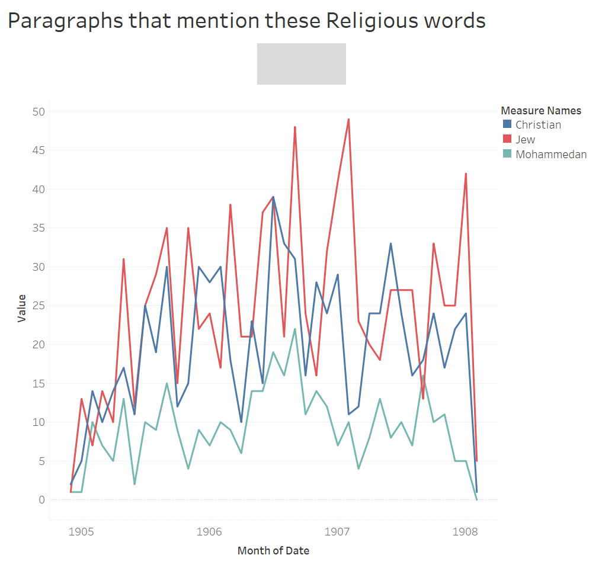

## The Religions being covered
Egypt is home to many different religions, however, I only plan to talk about the main religious groups in Egypt as well as one smaller group as a comparison. The two largest religious groups of Egypt are the Muslim community and the Christian community, with the Muslim community in particular making up the majority of the religious influence in the country. The smaller religious group I am talking about is Judaism, while Judaism is a very large religion internationally in the country of Egypt it is and has been dying out. To give accurate numbers, as stated in [The Cultural Atlas](https://culturalatlas.sbs.com.au/egyptian-culture/egyptian-culture-religion) “The vast majority of the Egyptian population (90%) identify as Muslim, mostly of the Sunni denomination. Of the remaining population, 9% identify as Coptic Orthodox Christian and the remaining 1% identify with some other denomination of Christianity.”

## Graph

The graph that appears above can be complicated to understand, so I figured that I should break it down and make it more understandable for most viewers. This graph is a visualization of how often the words “Jew”, “Christian”, and “Mohammedan” are mentioned in paragraphs of the Egyptian Gazette. I chose these words as they are the most common ways to refer to the people of these religions in Egypt and so are best suited for finding this information in the Egyptian Gazette. The information is separated into months throughout the years 1904-1907, the red line is the word “Jew”, the blue line is “Christian”, and the green line is “mohammedan”.

### Judaism
Jewish people as a whole are a very small part of the Egyptian population with there only being three Jews in the entirety of egypt as of right now. Why, then, does the graph above show that the word “Jew” is mentioned often in the Egyptian Gazette. I believe that the answer to this is that the Egyptian Gazette was not based around talking about the local groups but more the world and the news involved as whole, this would make far more sense as the news about Judaism in the world would coincide with the high number of mentions of the word “Jew”. As I researched some important events that occurred in Judaism over the years of 1904-1907 I came across a large event that must have caused the News to talk about it for many years. This was the Russian Revolution of 1905, which was a revolution that had an incredibly large amount of Jewish people in it, due to the horrible discrimination being put upon them by the Russian government. As stated in [The role of the Jews in the Russian Revolutionary Movement](https://www.jstor.org/stable/4205328#metadata_info_tab_contents) “While the Jews formed only seven million out of a total population of 136 million, about fifty percent of the membership of the Revolutionary parties was Jewish”. This event had long and big impacts on Judaism as a whole and would have most definitely provided a big spike in Jewish news throughout the world. This is, in my opinion, a strong reason for the large amount of time that the word “Jew” is mentioned in paragraphs of the Egyptian Gazette. I must also mention that while the word “Jew” was mentioned many times in the Gazette there is also a possibility that the word “Jew” could be a part of something else such as the name of a place or part of the word Jewel, however I believe that the vast majority of these mentions were based in talking about Judaism instead.

#### Christianity
Christianity as whole is one of the largest religions in the entire world boasting around 2.2 billion followers around the world. This humongous religion is also a large part of Egypts religious groups making up around 9% of the people in Egypt. However, as we have learned with Judaism and the word “Jew” being a large part of Egypt does not seem to be a big factor in if a religion is mentioned more or not in the Egyptian Gazette. I believe that the large amounts of mentions of the word “Christian” in paragraphs of the Egyptian Gazette is due to simply how big and notable of a religion Christianity is as a whole. Due to Christianities size there is always news and things going on that involve the word “Christian” hence the large amount of hits. The Egyptian Gazette is able to report on the news inside the country involving Christians as well as the many other important things going on with the religion outside of it. One notable Christian event that could coincide with the high number of times the word “Christian” appears could be the Indian Pentecost occurring in India in 1905. As talked about in [Indian Pentecost](https://www.christianitytoday.com/history/2008/august/indian-pentecost.html) the Indian Pentecost was a large religious movement in India where Christianity had a sudden and strong revival in the country due to various missionaries spreading their message. This had little to no effect on India however it most definitely made the news and caused a large influx in the amount of time the word “Christian” appeared in the Egyptian Gazette. This and many more events involving Christianity are constantly occurring around the world so to see such a high amount of times that Christianitty is mentioned in the Egyptian Gazette comes as little surprise to me. There is also the fact that sometimes the word “Christian” doesn’t always mean Christianity as it could be a name or a place. I do believe however, that the majority of the times that the word “Christian” appears is based around Christianity.

### Islam
Islam is the absolute biggest religion in the country of Egypt with is spanning a humongous number of ninety percent of the population as a whole. Why, then, you might as it is mentioned so little in the Egyptian Gazette as opposed to less notable religions in Egypt such as Judaism. I believe there are a couple of answers to this question, one of the most notable in my opinion is that the Egyptian Gazette focused more on outside news when it comes to religion as opposed to inside news so the mentions of Islam become smaller as opposed to Christianity and Judaism. Another and the most likely is that because the Gazette talked about outside news they don’t use the word “Mohammedan” as often as they would if it was about religion inside the country. This is due to the fact that while Mohammedan is a common word to refer to the Islamic people in Egypt, it is less common throughout the world. Therefore, the mentions of the word “Mohammedan” in the Egyptian Gazette focus more on the local and national news as opposed to the more widespread international news that the Gazette prefers to talk about when it comes to religion. After researching various sources I have also learned that Islam also was not a very active religion in the time period set with the Egyptian Gazette. The only thing of note was that the Ottoman empire was falling which was having some effect on Judaism but was also just bigger news that would subvert news about Judaism. This lack of Islamic news could also play a part in why the word “Mohammedan” is mentioned so little in the Egyptian Gazette.

## Comparison and Final thoughts
These three religions have provided me with many different conclusions and new information that I would never have known or thought of before. I have learned of the Egyptian Gazettes preference for international news, as well as how the local population of that religion does not affect the Egyptian Gazette very much in how often they talk about a certain religion. Christianity and Judaism are mentioned far more often that Islam both because thy had more newsworthy things occur in this time period but also because the word “Mohammedan” is less used in international news. I also have another theory as to why Judaims and Christianity are mentioned so often in the Egyptian Gazette. My theory is that due to the close ties religiously between Judaism and Christianity they are more often mentioned together or in comparison to each other than what would occur with Islam. Thus would lead to more results when it comes to the words “Jew” and “Christian”  as they could be mentioned in a story about the other religion. Even so, without all of these theories it is a fact that in the Egyptian Gazette, in a total expectation subversion for me, the word “Jew” appears the most out of these three words, “Christian” the second most, and “Mohammedan” the least. This is completely different from what I was expecting when I started this project and has allowed me to research more in depth and learn more things about why a newspaper like the Egyptian Gazette would talk more about each religion and how this came to be. 