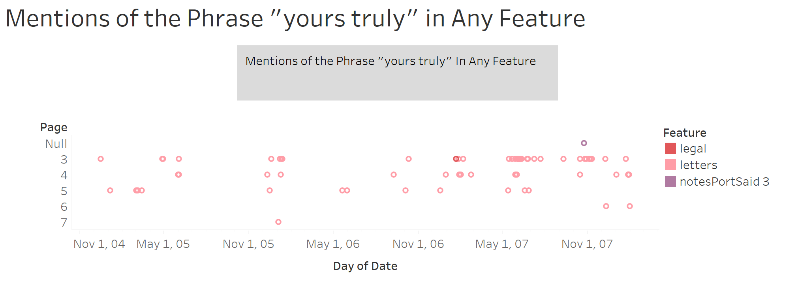

## Introduction
Our group is filled with many different questions with very few similarities between them all, however, after looking through what we were each using as a question and how we were researching we came to the conclusion that our group would best be summarized as one based around qualitative research. The question we decided to base our research on is how qualitative questions lead to the development of research techniques with xml and regular expression. The way to answer this question took us a long time to figure out due to how large of a question this is, we ended up having to collaborate and brainstorm many different ideas before coming up with a simple and effective solution. The solution we came up with to achieve this task was to create a general Xpath query that we could use in each of our individual projects and compare and contrast the data and information we got with this query. We all created visualizations based off of this Xpath query to make this goal more achievable. The question itself and the methodology used to solve were very useful for each of our individual projects, especially as many of our personal questions are complicated and difficult to answer.  With this group project question we can work on our own projects as a side effect of the group project question we are answering. In summary, we are a qualitative data group who are trying to answer how qualitative questions lead to the development of research techniques with xml and regular expression.

## Finding a Query
As our group had many different topics, finding a common query seemed like a rather daunting task. Tying religion to military ranks to mummies, etc. looked to be somewhat impossible, especially considering how each individual project was specific in its own unique way. Thus, our query ended up being broad to fit the various objectives we had, which ended up being tied to our research methods (qualitative research). The query ended up being how many times a certain word that related to our project showed up across the entire Egyptian Gazette digital catalog, in any feature. We had mentions of the words: “Commander”, “Turks”, “Migration”, “Yours truly”, and so on and so forth.

The expression we ended up using was //div[matches(.,'x', 'i')]/@feature, with “x” being the word we searched for. We put this into the XPath 2.0 search bar in the Oxygen Editor and queried the contents of the whole newspaper with our individual terms. Once the whole contents were queried, we copied over the results into a plain text editor, where we would edit it to be usable in an Excel spreadsheet. From there, we would copy it into Tableau, the application that visualizes the results.

The way the query worked shows how similar our data collection methods are. While the query itself is incredibly broad, it is a good representation of what we will do in our individual analysis projects. Specific searches would not work; thus, this method is likely the lowest common denominator that we have as a group.

## Creating Visualizations
With our XPath query, we were searching for a few simple results in common for otherwise uncommon topics of study. Our query yielded the feature, date, and page number of every division that contained a keyword of our respective independent research efforts. With this data we sought to generate a set of visualizations that used the same type of data in roughly the same style and theme, to be easily compared to one another for possible similarities and discrepancies in the patterns of each, which could indicate a connection between the different topics.

We chose to use the date, feature count, page number, and feature for our visualizations. We formatted them in roughly the same manner, with a basic scatterplot styling. We placed the date variable along the x-axis and plotted the page number variable along the y-axis. The feature count data points are placed at each of their respective dates and page numbers, and then color coded each data point with its corresponding feature name.  

This method of visualization provides for a simplistic, understandable representation of our data. The matching formats and color coding allow for an easy way to compare our seemingly unrelated data just from glancing at each of the charts. Weaknesses of this visualization are that you cannot gather much just from these charts, only use them to infer about events that may have caused them to have patterns that coincide at the same time, leading to further investigation and research. While that is a glaring weakness, there is not much else to start out from researching, as the topics in question do not have much in common, so we must find similarities and differences before any reasoning can be found.

## Comparing and Contrasting Our Visualizations
Once we completed our visualizations, we could embark on the analysis of our results. Since we each had such vast individual research topics, we were interested in comparing variables like page number, amount of data, the features that appeared most often, and the overall function our data would serve. Some proved to be more feasible than others:

### 1. Page Number
 

As we completed our individual research, we realized that there is more variance than we originally expected. While our visualizations are fundamentally the same, they each present data differently. Since we all align under the scope of qualitative research, we expected most results to appear on page three of The Egyptian Gazette. However, our visualizations show that research relating to individuals (for example: "Commander" and "Migration") appears to spread across more pages than visualizations based on specific topics (for example: "Religion" and "Mummy"). 

### 2. Features 

While comparing the visualizations, we also looked at the features where our data most appeared. It is difficult to identify exact results since the paper includes incomplete sections that do not have feature titles. This allows for easier navigation but does not show a complete picture. The features vary depending on the intentions of the research. The "yours truly" query appeared most in the Letters feature since it was specific to the Letter to the Editor section of the *Egyptian Gazette*. We ran the Xpath query to limit the search results to useful data rather than to identify the most common feature. This allowed for better quantitative data use during the research process. Contrastly, qualitative research attempts to discover which features discussed the topic. For example, the "Mummy" Xpath query revealed the most used features were Local and Egyptological. This led to more research questions and was used to understand the importance of mummies to the readers of the *Egyptian Gazette*.

### 3. Data Spikes

It was alluring to see when specific results spiked and dipped in results. However, when we attempted to draw links between rises and falls between visualizations, the results were inconclusive. In the Fall of 2006, the "religion" visualization displayed an uptick in results. We attempted to research the reason and compare it to the uptick of results for the "Turks" visualization: to no avail. Since the *Egyptian Gazette* files are incomplete, it is challenging to know if the spike is due to complete access to data or the paper's coverage of the topic at the time. 

## Overall Strengths & Weaknesses In Microhistorical Qualitative Research
Ultimately, the digital research methods we used with the *Egyptian Gazette* as our microhistorical source were complex and nuanced per each person's research question; due to these complexities and nuances, various strengths and weaknesses arose during the employment of our chosen methods. A chief strength of our chosen XPath query and visualization format was their ability to encapsulate the significance of our search terms. The sheer quantity of results that our queries yielded provided us with adequate perceptions of how significant our chosen research topics were within the *Gazette*, which is a useful starting point for the research process. Our chosen query and visualization also demonstrate the distribution of our search terms over multiple years of *Gazette* issues. The ability to ascertain any trends in the mentions of our search terms, such as if the term has a higher proportional frequency in certain months, is vital for the qualitative research we each embarked on. Our understanding of potential trends allowed for further research and analysis since we could consult secondary sources or more XPath query results to help explain these trends. 

Some weaknesses arose, though, from the confining nature of our chosen XPath query. Our query limited our results to only yield from *Gazette* items labeled as features. Although this provided each of us with a smaller, much more manageable amount of data than a raw word count, it significantly limited the amount and types of trends we could analyze. Also, a weakness arises from the rather rudimental level of our chosen visualizations. Although these visualizations provided sufficient starting points for the research process, they did not yield enough data alone to be able to approach each of our complex qualitative research questions. This weakness, though, is merely reflective of the holistic qualitative research process. Qualitative research's reliance on data beyond easily quantifiable characteristics meant we had to get creative to come up with numerical data for each of our projects. Many of us had to try multiple search terms that were relevant to our research topics before we even acquired enough data to transfer to a visualization.

Ultimately, we feel that our chosen XPath query and visualization format effectively initiated our research processes and created a compelling concept to discuss as a group. The query and visualization format may not have been enough to answer our research questions by themselves, but they were helpful when accompanied by further research. We recommend utilizing similar digital methods to other qualitative researchers; however, we suggest limiting the XPath queries to multiple types of items within the *Gazette* rather than just features to see if another query yields a more desirable amount of results.  Overall, these digital methods are imperfect, but in their imperfections, they reflect the unique limits and challenges of microhistorical research.

## Conclusion
Digital Microhistory as a whole serves as an experimentational launching board between the realms of quantitative and qualitative analysis, and by nature our project was able to develop into an apt reflection of that reality. Within our project’s inquiry, we were faced with challenges beyond the scope of the dichotomy of using computational methodology to encompass qualitative data, specifically in that each specific personal topic was vastly different from the other. In the pursuit of trying to understand how to bridge these gaps, we developed a slightly broadened X-Path query, //div[matches(.,'x', 'i')]/@feature, in order to encompass a similar objective within a common research method. It was through this we came to realize that within the confines of qualitative data, a good launching pad is looking at numerical counts of usage of “trigger words” along with location of said usage, and moreover supplies a unifying factor between distinct topics of qualitative research. In looking to display our data we opted for a scatterplot styling as it most aptly reflected the particular factors returned from our query: feature, date, feature count, and page number of every division that contained a keyword of our respective research efforts. This visualization was an easily understandable representation of our findings, and allowed for effectiveness in comparing various results across the independent research efforts. These differences highlighted certain vantage and null points for each individual project, and supplemented our notions as to where to continue looking for more specific information on our individual topics. In reflection, we realized that the query was able to encapsulate the significance of key terms while also serving as a helpful catalyst into more specialized research; however, while supplying us with a more workable set of data it limits the amount/type of trends we could analyze, and so you would need more queries in order to substantially supplement one’s research. Overall, the most profound lesson learned was the amount of work and research that could still be done in regards to computational research methods concerning qualitative data, and that it is necessary to go through multiple rounds of trial and error and experimentation in order to find more defined yet transferable methods of querying for qualitative data. Furthermore, it may be concluded that in the vast diversity within qualitative data that a “one-size-fits-all query” simply can not be overarchingly specific and yield consistent, detailed, and specialized results for each pursued topic. Ultimately, this project reflected the intricacies encompassed in the microhistorical digital research methodology in order to relate the surface level disconnect between qualitative information and computational analysis. 
