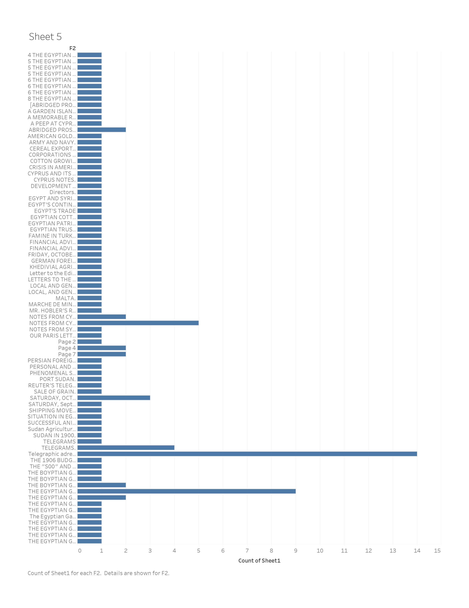

The government had a variety of programs to increase agriculture, one of the main crops they pushed was the production of wheat. It was a crop that was easy to multiple and produce mass amounts. One of the programs was the Cairo Agricultural show; this was an opportunity for the grower to show off their wheat production to potential buyers. It was a great networking event for both farmers and produce buyers. The best crop of the season had the opportunity to win cash prizes, in recognition of their large work. Another thing the government did was the Suez canal, which was a significant government transportation portal for the exporting of wheat. Great Britain exported most wheat, leaving little for the people “as little as 1/5 of the wheat was kept for the people” (The Egyptian Gazette, An English Daily Newspaper, Established In 1880, Editor and Manager: R. Snelling Price: One Piastre Tariff) Of the 1/5 portion is reproduced into other products such as bread, etc. This action was done with a little more of a selfish nature of increasing economic revenue rather than helping the individual farmer. However, to make up for this selfish nature, the government would deal with the crime of people stealing each other’s crops and has taken these cases very seriously. These weren’t too common, but sometimes these cases even escalated to murder.

Over time, controversy began to grow about whether wheat or cotton was more profitable. The British saw wheat as mainly a single-dimensional product that was only for flour production. The thought instead, the big cash crop was cotton due to the greater demand during the civil war times and greater transferability. This is mentioned throughout the feature “British flour for Egypt” in the Egyptian Gazette. Although the British thought this, they still did a lot to help increase the production of wheat; in the Egyptian Gazette, the feature “abridged prospectus” explained the process of purchasing the land and how the process was meant to incentivize people to buy and start cultivating the wheat crop. The most popular land was lower Egypt which had the rich soil to grow good wheat. The process of securing land could get a little complicated, but there was a program to help poorer people get their foot in the door. Through this program, you could buy a share of land and make payments. However, if you miss only one payment, your entire land could be revoked. These payments could be expensive, especially with the hefty tax you pay to auditors. The auditors themselves were also noticeably know to be cruel and unfair, flaunting their power. This extreme policy and inconsiderate treatment really pressured farmers to produce most of the crops. This excessive production made local features such as “Khartoum’s wheat crop” describe wheat as a very profitable crop since it was written from the local perspective. Throughout the paper we find these contradictory articles of local’s vs British persuasion I can see thorough business features, world reposts, sometimes even personal articles people express show this tension is affecting the consciously or subconsciously.

These variety of government programs led to increase in the cultivation of the wheat crop but sacrificed the fair treatment of the farmers. The government created a hamster on the wheel type system. The focus was shifted from the people to instead focusing on forging perceptions and paying taxes overseas. However, due to the government distracted focus, the middlemen tax collectors were able to bend the rules and regulations as they saw fit. Therefore, creating the problem of bribery and illegal manipulation. These unfair systems and poor representation left the government in a negative light of the common people eyes. Throughout history we can see how distrust of the government often leads to riot and chaos. Thought the distrust in this government was common, it did run smooth enough to keep the people in check and the economy growing. This can be seen in the Egyptian gazette feature called "British Flour". Throughout this text, they talk about the shift from wheat production to more cotton production due to its further profitability. The article details how as wheat increased, the demand and sales remained the same, and the primary consumers were the British Mill. The gazette Cereal tables exhibit that although foreign governments such as the British didn't increase their wheat purchase during March of 1907, wheat remained at a sturdy price due to Egypt's ability to distribute the extra grain elsewhere. This displays wheat's ability to have stable and growing production and how it was an essential part of commerce, even though government support was shifting.

## Xpath
`//p[matches(., 'government', 'i') and matches(., 'wheat', 'i')]`

## Links
[Land Owner Rule Post](https://dig-eg-gaz.github.io/post/2021-analysis-barry/).
