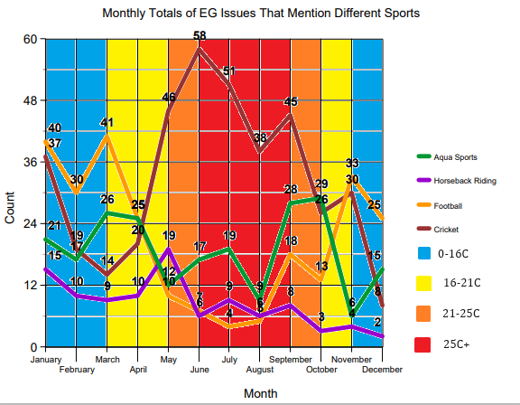
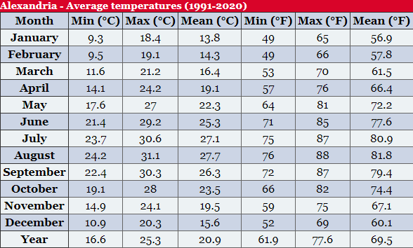

Egypt in the early 20th century was a unique hub of cosmopolitan gathering. It was a central location for travelers, migrants, colonialists, and natives, and despite the many different backgrounds and origins of the people who populated Egypt, one trait remained constant: a desire to be entertained. Entertainment was found in Egypt in a variety of denominations, including theater, steamboat trips, and sporting events. Sporting events in particular had significant cultural influence in Egypt, serving as entertainment for the local populations as well as a shared interest among both local and colonialist inhabitants. The mention of sports throughout the Egyptian Gazette reflects the interests of the newspaper’s readers as well as providing insight into the ever-changing daily lives of the residents of Egypt. Perhaps more importantly, they present patterns through longevity that reflect how sports as a means of entertainment interact with other outlets of life in early 20th century Egypt.

In order to draw any conclusions about sports in the Egyptian Gazette, a comprehensive metric for identifying where sports are mentioned first had to be established. After many readings of Egyptian Gazette articles, as well as external research, it became apparent that the most common sports being played and documented in the newspaper at the time were aquatic sports, horseback riding, football (soccer), and cricket. In order to find instances of these in the existing Digital Egyptian Gazette database, a simple X-Path Query was constructed, starting by searching for football. More specifically, using the “matches” feature when searching for a div within a div. The query appears as follows: “//div//div[matches(., 'football', 'i')]”. This returned all of the instances of the word “football” within the Egyptian Gazette. A similar approach was taken for the remaining sports, with the queries for “aqua sports” and “horseback riding” simply using two “matches” statements to ensure the most comprehensive results were returned. Hence, the horseback riding query appeared as: `//div//div[matches(., 'horse', 'i')][matches(., 'riding', 'i')]` and the aqua sports query appeared as `//div//div[matches(., 'aqua', 'i')][matches(., 'sports’, 'i')]`. It is important to note that neither the words “aquatic” nor “horseback” were included in full. Rather, “horse” and “aqua” are used in the queries as a more inclusive search term that is likely to return more results. The final query utilized was for cricket, arguably the most popular sport of the time. In this query, however, the type “wire” was excluded to void all mentions of cricket games occurring in England that were telegraphed to Egypt and written about in the newspaper. Therefore, the query for mentions of cricket in the Egyptian Gazette appeared like this: `//div//div[matches(., 'cricket', 'i')][not(@type="wire")]`. The term “wire” does not need to be excluded from other queries, as cricket had disproportionately more mentions in telegraphs relative to other sports, which had practically none.

After receiving the total number of instances in which these four different sports were mentioned throughout the Egyptian Gazette database, it was almost time to visualize the results. However, the goal of this study was to draw a more longitudinal analysis of sports over time. The best way to do this was to count the total monthly mentions of each sport, regardless of the quantity of times it is mentioned in one issue or the year that the issue was published. This metric would provide a dataset that shows the monthly popularity of each sport, as sports are known for being both seasonal occurrences that result in fluctuating popularity. So, using a simple C++ algorithm written in Visual Studio Code, the number of “repeat mentions” for any sport was subtracted from the total monthly sums of mentions of that same sport, void of year. Algorithmically, it appeared like this:
- `j=(totalIssueMentions[i]-1)` //calculates 1 less than the total number of times a sport is mentioned in 1 issue and sets it equal to variable j
- `issueMention[i]=(totalIssueMentions[i]-j)` //subtracts variable j from the total number of times that sport is mentioned in that same issue, which will always equal 1. _This effectively counts the issues rather than the mentions_. This value is then set to issueMention variable.
- `totalMontlyMentions[k]=∑issueMention[i]` //calculates the summation of the total number of issues that mention the same sport in the same month

The use of a dynamic 2-dimensional array made it so every issue regardless of year was included in the calculations, each issue was only calculated once, and each sport was counted independently of the other three sports for each month. The array value of [i] is a counter that starts at 0 and runs to ∞ and increases for every new issue. The array value [k] is a counter that starts at 0 and runs to 12 and increases for every new month. The result is a total of the monthly counts of issues of the Egyptian Gazette that mentions that particular sport. On a graph, it is visualized as follows: 

This visualization contains many other variables in addition to the monthly total number of issues that help identify patterns related to interest in sports in early 20th century Egypt. First, is average monthly temperature. It is evident that in winter months where the average monthly temperature is between 0 and 16 degrees Celsius that sports recordings in the Egyptian Gazette are at their lowest. This is likely due to less sports being played or watched due to the uncomfortable outside temperatures. On the other hand, fall and spring months where the temperature averaged between 16 and 25 degrees Celsius saw relatively higher counts of sports mentions in the Gazette. However, sports interacted with each other just as responsively as they did with monthly temperatures. Namely, the summer spike in attention to cricket took away from the journalism directed at other sports. The months of June-August display all-time highs for cricket, and all time lows for all other sports, suggesting that cricket journalism crowded out attention towards other sports.

In conclusion, sports in the Egyptian Gazette were an outlet of entertainment and cultural diffusion. They were extremely important to the daily lives of both Egyptian residents and passer-bys, and the information displayed here identifies several significant patterns of why certain sports were more/less popular at different points in the year. These results provide modern historians with a comprehensive and warranted view into the journalism of sporting entertainment in early 20th century Egypt.

## Works Cited:
“Climate - Egypt.” Egypt Climate: Average Weather, Temperature, Rain - Climates to Travel, 2021, www.climatestotravel.com/climate/egypt. 

