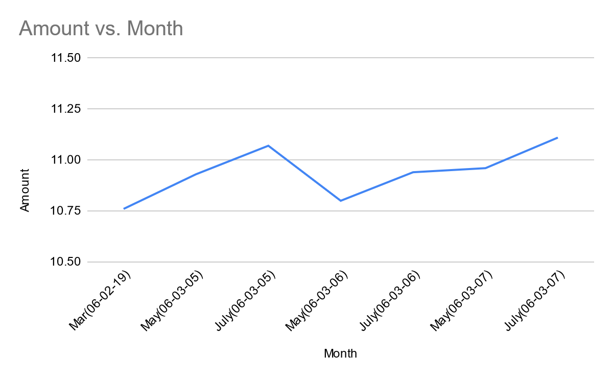

For my project, I decided to research Egyptian futures. Originally I thought that the futures that would be most relevant in the gazette as well as the Egyptian economy would be oil futures. After some research, however, I found that oil futures could have been more relevant in the gazette. This surprised me because of how important oil futures were during the 20th and 21st centuries. After consultation of secondary literature, I realized that the reason that they were not extremely relevant in the Gazette is that oil was not seen as the agent for the industry as it is seen today. At the turn of the 20th century, uses for oil were limited to things like lanterns, and candles, which means that it was only seen as a source for light. The future uses for oil, for things such as petroleum and powering the automobile, had not quite been discovered yet. Another limiting factor for the historical evolution of oil in the Egyptian economy was British control over Egypt. During the early 1900s, Great Britain still had somewhat of a strangle hold on the Egyptian economy. Egypt was subject to any rules or tariffs that Great Britain set for them. This included a rule that limited Egypt for imposing tariffs on oil importation and exportation. Which meant that it was not in the economic interest of Egypt to invest in oil production or trade. At the time, cotton was a far more important commodity, which is why it was mentioned far more in the Gazette. The reason cotton was a far more important commodity was because of its many uses and implications as a textile. One, somewhat obvious, use of cotton at the time was for clothing. The slightly less obvious uses for it would be for medical products such as dressings and bandages, bindings for books, and nets for fishing. This means that it is not hyperbole to say that cotton was an instrumental part of the Egyptian economy. After some research in the gazette and multiple queries, I found a section called closing reports data, which was essentially an economic report. In this report, there was a pricing for cotton futures every month or so that showed the growth rate of cotton futures in Egypt. After visualizing these data points in a graph, which can be seen below, it is obvious how economically steady cotton was.

The query I used that eventually led me to the closing reports data was `//div[contains(., "cotton futures")]`. I found the process of finding successful Xpath query’s very difficult. The reason for this was the lack of helpful articles containing information about futures. Originally my queries were for oil futures, however after doing these query’s and outside research, I realized the lack of relevance that oil futures had in the gazette. After realizing that cotton futures were the more relevant topic, it took quite some time to find quantitative data regarding cotton futures. Most of the articles regarding cotton futures that could be found in the gazette were advertisements or things of the like. That is until I discovered the closing reports data, which gave me the quantitative data that I need in order to draw a history of cotton futures in Egypt. After analyzing the visualization of the data contained in the closing reports data. This data shows how consistently sturdy cotton was, in terms of its economic abilities and its applications as a textile in early 20th century Egypt.

## Resources

- Bautista, R. M., and C. G. Gehlhar. “Price competitiveness and variability in Egyptian cotton: Effects of sectoral and economy-wide policies.” Journal of African Economies, vol. 5, no. 1, 1996, pp. 21–51, https://doi.org/10.1093/oxfordjournals.jae.a020898. 

- Richards, Alan. “Technical and social change in Egyptian agriculture: 1890-1914.” Economic Development and Cultural Change, vol. 26, no. 4, 1978, pp. 725–745, https://doi.org/10.1086/451056.

