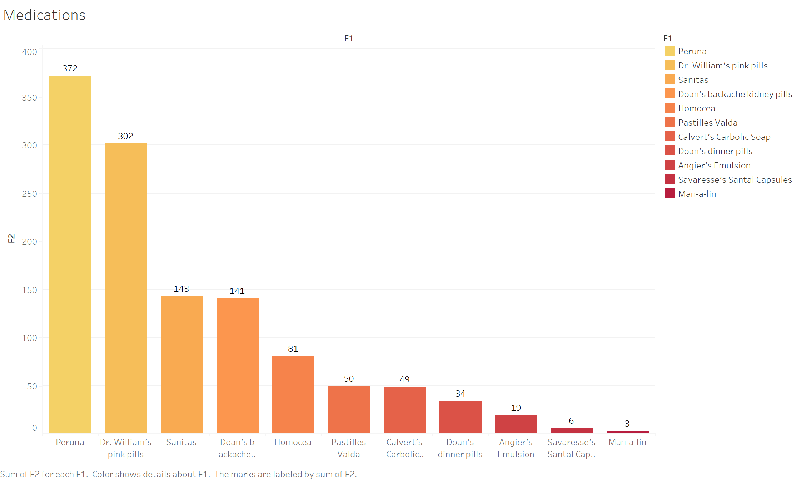
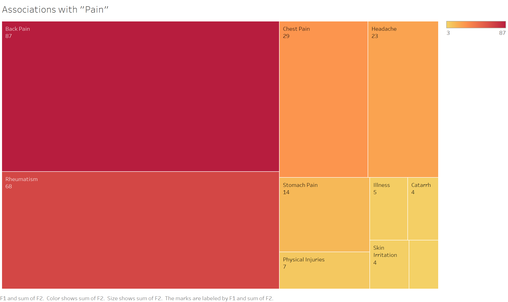

For my analysis project, I decided to investigate the various medications advertised in the paper. The reason why I chose this was because of the crazy claims these advertisements made. Medication and remedies for certain illnesses and pains have existed for a very long time. However, regulations to produce these medications didn’t come along until way later. The earliest of these regulations started with voluntary drug approval in 1905, but it wasn’t until 1938 when regulations for drug safety were put in place (FDA, 2006). Because of this, a lot of these pharmaceutical companies could get away with making medications out of questionable ingredients and claiming that they cure a whole list of symptoms (Library of Congress). Most of these medications were manufactured in the U.S., as the country was one of the leaders in the pharmaceutical industry at the time (Hamilton, 1951). These medications were then exported to other parts of the world, including Alexandria, Egypt where advertisements for these medications appeared in the local newspaper. My goal with this project was to look at what health issues and medications were brought up the most in the newspaper, The Egyptian Gazette, with the purpose of finding correlations between the two and to paint a picture of what health and pharmacy were like in Alexandria in the early 1900s.

To accomplish this, I started by coming up with a list of medications advertised in the paper. This proved to be slightly difficult since all the advertisements are different and none of them are labeled the same. Instead, I tried to find a specific word that all the medication advertisements had in common. This word wound up being the word “druggist” since all the medication advertisements contained a line and distribution containing this word. I was then able to use the query `//div//div[matches(., ‘druggist’, ‘i’)]` to find all the divs containing this word and, therefore, all the medications advertised. From there, I was able to comprise a list of 11 medications. The shortcoming of using this query, however, is that I probably missed any medications that had advertisements that did not contain this word. From there, I took each medication and used the query `count(//div//div[matches(., “medication name”, ‘i’)])` to find the number of times each of these 10 medications were advertised in the paper. 
	
After finding all the medications, I wanted to find out what ailments were mentioned the most in the paper. This was accomplished by looking at certain keywords associated with the word “pain”. The query used was `\w+ \w+ pain\w* \w+ \w+` with the word “paint” being excluded in order to limit the number of false positives in my results. After this, the results were counted to see what ailments were associated the most with the word “pain”. The results of this query and the previous one were then analyzed and made into visualizations using Tableau.
	

This first visualization shows the results of the medication advertisements in the paper. Peruna by far had the most advertisements with 372, followed closely by Dr. William’s pink pills with 302. All other medications had less than half as many advertisements in the paper with some only having a handful. 

The next visualization shows the results of the ailments associated with “pain”. Back pain and rheumatism appeared the most frequently with 87 and 68 hits respectively. Chest pain and headaches have about half as many hits as rheumatism with 29 and 23. All other ailments produced less than 20 hits.

After doing some further research on each of the medications, some correlations can be made from these two sets of results. Back pain and rheumatism were two of the biggest complaints for ailments mentioned in the paper. Interestingly, the second most advertised medication, Dr. William’s pink pills, claims to be a treatment for rheumatism while the fourth most advertised medication, Doan’s backache and kidney pills, claims to be a treatment for backaches. So, it is clear that joint and back problems were common back in the early 1900s and medications for them were in high demand, hence the large number of advertisements. However, this pattern does not hold true for every medication. On the other hand, Peruna was by far the most advertised medication and is said to treat catarrh, but catarrh was only associated with pain a total of 4 times in the paper. This is a limitation of the query used. Catarrh is an illness caused by the buildup of mucus in the nose and throat, and while there are a few instances of illnesses being associated with “pain”, illnesses and diseases tend to not be described as painful (NHS, 2022). Therefore, very little of the results are made up of illnesses. A similar problem occurs with the third most advertised medication, Sanitas. Sanitas is a disinfectant used against bacterial infections. Bacterial infections were not associated at all with “pain”. This may be because bacterial infections weren’t considered to be painful, but other factors could’ve influenced this as well. For instance, bacterial and parasitic infections weren’t as common among the upper-class citizens who read this paper as they were for the working class, which is probably why these infections weren’t necessarily mentioned (Derr, 2019). This is also probably why there weren’t many medications advertised in the paper that treated these kinds of infections, as parasitic and bacterial infections were contracted mostly by the people working in the riverbanks and cotton fields (Derr, 2019). Overall, most of the other medications tend to follow the initial trend. Pastilles Valda, a remedy for chest pain, is the sixth most advertised medication while chest pain is the third most mentioned ailment. Doan’s dinner pills and Angier’s Emulsion are both stomach medications ranking at eighth and ninth for most advertised while stomach pain is the fifth most mentioned ailment. Despite the limitations, there is a trend of supply and demand that can be seen. For future studies, it may be beneficial to broaden the scope of the query used for ailments to include illnesses, diseases, and infections, which would help get an even more accurate idea of what health and pharmacy looked like in Alexandria in that time period.

## Literature Cited
1. Food and Drug Administration. (2006). A History of the FDA and Drug Regulation in the United States. FDA. Microsoft Word - 7B5F2254.doc (fda.gov)
2. Hamilton, B. (1951). The Medical Professions in the Eighteenth Century. The Economic History Review, 4(2), 141–169. https://doi.org/10.2307/2599120
3. Jennifer L. Derr, "Cruel Summer," from _The Lived Nile: Environment, Disease, and Material Colonial Economy in Egypt_. Stanford, California: Stanford University Press, 2019, 99-126.
4. Library of Congress. Catarrh Remedy and Peruna Scandal: Tpoics in the Chronicling America. Library of Congress. Introduction - Catarrh Remedy and Peruna Scandal: Topics in Chronicling America - Research Guides at Library of Congress (loc.gov)
5. NHS. (2022). Catarrh. NHS. Catarrh - NHS (www.nhs.uk)