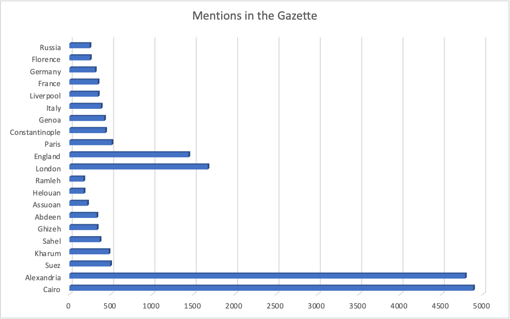
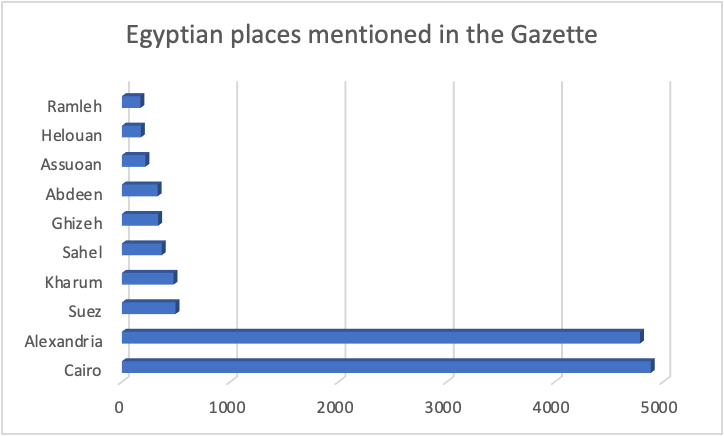

| Place          | Latitude | Longitude | Times mentioned |
| -------------- | -------- | --------- | --------------- |
| Cairo          | 30.0444  | 31.2357   | 4,885           |
| Alexandria     | 31.1992  | 29.8952   | 4,786           |
| London         | 51.5074  | \-0.1278  | 1,673           |
| England        | 52.531   | \-1.2649  | 1,442           |
| Paris          | 48.8589  | 2.32      | 512             |
| Suez           | 29.9745  | 32.5371   | 495             |
| Kharum         | 15.5636  | 32.5349   | 477             |
| Constantinople | 41.0064  | 28.9759   | 435             |
| Genoa          | 44.4073  | 8.9339    | 422             |
| Italy          | 42.6384  | 12.6743   | 383             |
| Sahel          | 14.0279  | \-0.7718  | 368             |
| Liverpool      | 53.4072  | \-2.9917  | 347             |
| France         | 46.6034  | 1.8883    | 344             |
| Ghizeh         | 30.0081  | 31.2109   | 334             |
| Abdeen         | 30.0383  | 31.2423   | 330             |
| Germany        | 51.1638  | 10.4478   | 311             |
| Florence       | 43.7699  | 11.2556   | 251             |
| Russia         | 55.7551  | 37.5909   | 246             |
| Assuoan        | 24.0911  | 32.8973   | 217             |
| Helouan        | 29.8414  | 31.3008   | 175             |
| Ramleh         | 30.4403  | 31.1553   | 171             |

We decided to make our own group since we found that our topics could be similar or related. Our topics were theaters, murder, and sports. When analyzing the similarities or how related they might be, we found that both theaters and sports were a source of entertainment, but the relationship between entertainment and murder was quite unclear. That is when we decided we had to go beyond our topics, and find something else that could benefit us all. So, after digging a bit deeper, we found that we could work on a query that could work for all of us by making a part of it easily substitutable. We also realized that something that we could focus on could be places. Location was something that could add significantly to our projects, especially since we could explore the relationship between locations that were hotspots for events in the Egyptian Gazette and locations that could be significant to our individual projects.

To find the most mentioned locations in the Gazette, we had to develop a search that would actually find the greatest number of locations. Since the place name tag isn’t used very often, we had to take another approach to accurately find locations. To do this, we first developed a set of phrases that often came before a location name, so that we could search for those and ideally the place names would follow. We chose to use the following terms: in, near, to, at, and by. There were other terms, such as “from” that often preceded place names, but those had more to do with shipping and advertisements and less to do with events occurring in these places like we were looking for. Using those phrases, we created the following regular expression search: `(in|near|to|at|by) [A-Z]\w+`

This would effectively search for any of our key phrases that were followed by a space, capital letter (since place names are capitalized) and the rest of that word. The space between the set of parentheses and brackets was crucial, because otherwise the search would return words that start with in or at, such as “into” or “attention.”

While that regular expression search was mostly effective, there were too many results to reasonably work with, so we had to refine our search in some way. We chose to exclude advertisements, because while advertisements often mentioned place names, they weren’t actually recording events happening. Most advertisements containing locations were talking about shipping or traveling, which we felt would skew the results towards these port cities and away from other centers of local activity. So, in our search, we added “restrict to XPath” with the following query: `//div[not(@n=”1”)]//div[not(@type=”advert”)]`. This would eliminate the entire first page of the Gazette from our results, which was full of ads, as well as any additional advertisements that contained the div type “advert.”

Once we had our results from this search, we copied them into Sublime Text to simplify them down to only the place name. We then put that list into Voyant Tools, where it ranked the words based on how often they were mentioned. Most words were place names, but there were a few that weren’t quite relevant, such as “mr.” We then went through that list manually to find the top ten Egyptian cities mentioned, as well as the top ten cities overall. 

When looking at the most mentioned place names, we noticed that while Alexandria and Cairo were pretty common, the majority of our findings represented cities and countries outside of Egypt. This data suggests that international affairs are pretty popular or relevant to the Egyptian Gazette and its readers. While it is not something that we queried for, we do know that this is true, since when coding the issues, we encounter a lot of information on shipping, steamers, and movement of people. These recurrent topics are seen in recurrent features of the Gazette, such as Steamer Movements, Shipping Movements, and Movement Maritime. European countries specifically are also prevalent in the datelines of letters and telegrams, with a lot of communication coming from major cities like London and Paris. 

<noscript></noscript><object class='tableauViz'  style='display:none;'><param name='host_url' value='https%3A%2F%2Fpublic.tableau.com%2F' /> <param name='embed_code_version' value='3' /> <param name='path' value='views&#47;NotableLocationsintheEgyptianGazette&#47;Sheet5?:language=en-US&amp;:embed=true&amp;publish=yes' /> <param name='toolbar' value='yes' /><param name='static_image' value='https:&#47;&#47;public.tableau.com&#47;static&#47;images&#47;No&#47;NotableLocationsintheEgyptianGazette&#47;Sheet5&#47;1.png' /> <param name='animate_transition' value='yes' /><param name='display_static_image' value='yes' /><param name='display_spinner' value='yes' /><param name='display_overlay' value='yes' /><param name='display_count' value='yes' /><param name='language' value='en-US' /><param name='filter' value='publish=yes' /></object>
                

For the visualization we decided to use Tableau, since it opens the possibility for a more interactive representation. We geolocated each of the cities in our table (seen above) and graphed them into a map. Since the times the place was mentioned was what was really important in showing prevalence of places in the Egyptian Gazette, we modified the visualization to incorporate that. To do so, instead of just pointing out the places, we plotted dots in different sizes to showcase the amount of times the place was mentioned throughout the Gazette. Though the dots are moreless spread out with prominence in both Egypt and Europe, it is clear that the most mentions are of Egyptian places. Following Egypt would be England, which makes sense since Egypt was an English colony. Since the Gazette was not written in Arab, but in English and French it makes the most sense to have England and some english cities as second most mentioned, since the English settlers would be interested about what is going on in their own country, followed by France, to which the newspaper is sometimes addressed due to language.
