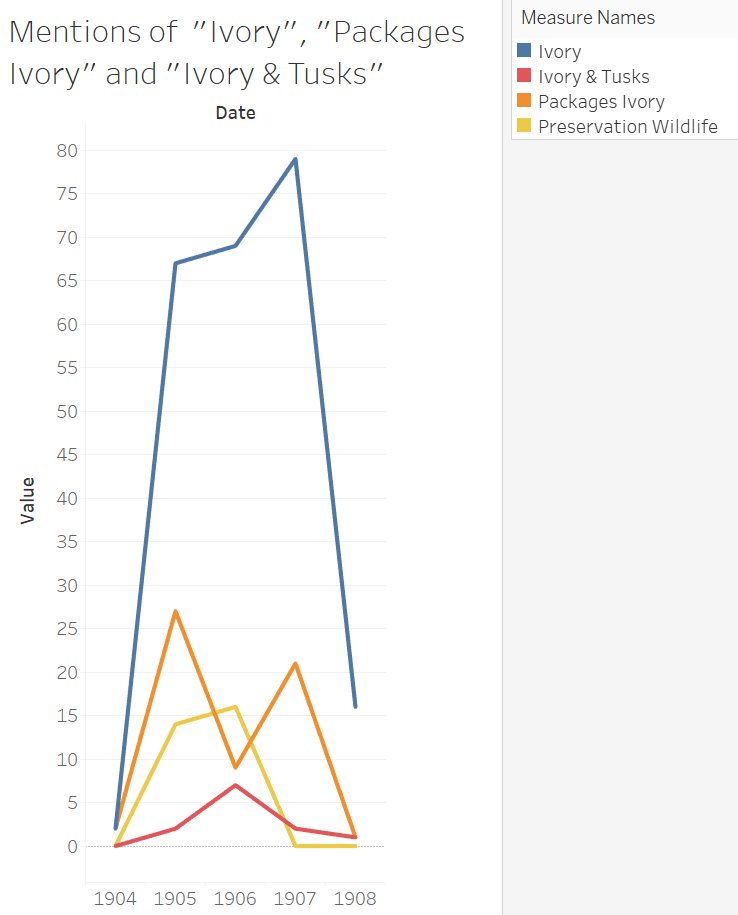

The turn of the 20th century marked a unique period, in that antiquated laws and customs were beginning to clash with an industrial, and increasingly globalized society. With these changing times, the relation between humans and animals changed too, as various exotic creatures were exploited for commercial, entertainment, or recreational purposes. I started by noticing frequent mentions of ivory sales throughout the gazette, which drew me first to reading about elephants. One common way in elephants were used was for harvesting Ivory. Despite there being laws put in place to limit the number of [elephants being killed for their tusks](https://www.ubuntuwildlifetrust.com/2020/10/30/african-ivory-trade-history), sale of both legal and contraband ivory was still frequent, as shown in select articles throughout the gazette. While reading through the gazette, there were also multiple instances of elephants, tigers, lions, and other animals being mentioned, as well as the context in which they were brought up. Through researching this, a better idea of how animals were viewed in the context of empire, namely in Egypt, can be better understood, and give us insight to how society viewed animals as a resource at the time. My main question in conducting this analysis was “how were animals viewed in the early 20th century?”. In order to find an answer to this question, I looked at the _Egyptian Gazette_, along with other supplementary materials to gain a better idea of   To begin my research, a quick look at the frequency of animal mentions was made. Below is a chart listing the most frequent words that yielded results related to animals. While the words in the graph may not seem wholly connected, these were the most frequent ways in which animals were mentioned, that also included relevant information to my analysis project.

|**Key word**|**Number of Mentions**|   
|---|---|
|  Ivory         |  233                     |  
|  Elephant      |  64                      | 
|  Zoo           |  21                      |   
|  Giraffe       |  15                      |  
|  Hunting       |  5                       |  
|  Safari        |  4                       |  

From this table alone, we see that ivory sale was the primary way in which, of these three topics, animals were discussed within the gazette. It is important to note that I excluded the search for “Hunting” on its own, as there are many advertisements for hunting and fishing equipment, which is in of itself a different piece of the gazette to be analyzed. With this information, I then ran a series of queries that narrowed down my results from the broad “ivory” category. Two examples of my queries were `//p[contains(., 'packages ivory')]` and `//div//div[matches(.,'ivory', 'i')][matches(., 'tusks', 'i')]`. When I gathered my results from these queries, I divided the number of results yielded by the total number of instances of “ivory”, in order to get a clearer idea of how much these specifications narrowed down my results. The phrase “packages ivory” made up a startling 25.75% of all results, while ivory and tusks only made up 5%. 

This visualization was made in Tableau, as it allows Through these results, it becomes clear that elephants were seen as almost a separate entity from the ivory they yielded. The body part that yielded ivory (tusks) was rarely seen associated with ivory and its sale, while packages of ivory, whether in shipping or in the market, was mentioned more frequently. There was also a spike in mentions of the Ordinance for Preservation of Wild Animals and Birds (enacted 1903) during issues in 1906, which also saw a sharp decrease in mentions of “packages ivory”. There was little association between the animal itself and all mentions of ivory, largely due to the commercial nature of the articles featuring ivory (most being the Sale of Ivory and Rubber news feature). [Ostrich feathers](https://www.cityoflondon.gov.uk/things-to-do/history-and-heritage/london-metropolitan-archives/collections/ostrich-feather-trade) were another way in which animals were sought out for their material goods, and this trade worked its way through Egypt to be exported to London. While harvesting of these feathers eventually became non-lethal for the animal, it serves as another example of how animals were exploited for commercial and luxury reasons. When searching through the articles, I came across a few that discussed owning exotic animals as pets, which was quite interesting. One article had Sudan giraffes for sale, listed as a “fine pair, male and female”. Other articles discussed the Sultan’s own collection of animals, or news regarding new animals being shipped in for Cairo’s Zoological Gardens, one instance of which I’ve outlined below. 

> “We hear that Capt. Flower Bey is on his way back from the Sudan with a collection of nearly 200 living animals for the Cairo Zoological Gardens, including two elephants, several lions, and a great number of antelopes of various species.”

The shipment of new animals to the Cairo Zoological Gardens was noteworthy enough to be mentioned in the gazette, and exotic African animals are the main ones listed in these types of articles. Other mentions of Captain Flower in the gazette list more types of animals gathered, all along the Nile river.  Along with the acquisition of animals, there is frequent mention of hunting, largely in the form of the Thomas & Son’s tailoring company, which offers custom tailoring for those who could afford hunting as a sport. Both these examples show how much of a fascination with hunting and collection of animals was, as entire businesses or expeditions were centered around them. 

With this information in mind, the gazette begins to paint an interesting picture of how animals were viewed at the time. Elephants were seen as a separate concept to the ivory they yielded, and otherwise were rarely mentioned throughout the gazette. Between Ivory, the Zoological Gardens, and hunting for sport, along with many other small instances of purchasing exotic species, animals were seen as an entertainment resource, that the wealthy could afford to hunt, the average person could see in a zoo, and the eccentric could purchase. 

## Works Cited
- Hearn, Jemma. “Lets Talk about the History of the African Ivory Trade.” Ubuntu Wildlife Trust, October 30, 2020. https://www.ubuntuwildlifetrust.com/2020/10/30/african-ivory-trade-history/#:~:text=In%20the%201900%2C%20there%20were,1.3%20million%20elephants%20were%20left. 
- “Ostrich Feather Trade.” City of London, March 3, 2023. https://www.cityoflondon.gov.uk/things-to-do/history-and-heritage/london-metropolitan-archives/collections/ostrich-feather-trade. 
- Thompsell, Angela. “Does Legitimate Ivory Trade Encourage Poaching in Africa?” ThoughtCo, July 28, 2018. https://www.thoughtco.com/ivory-trade-in-africa-43350. 

