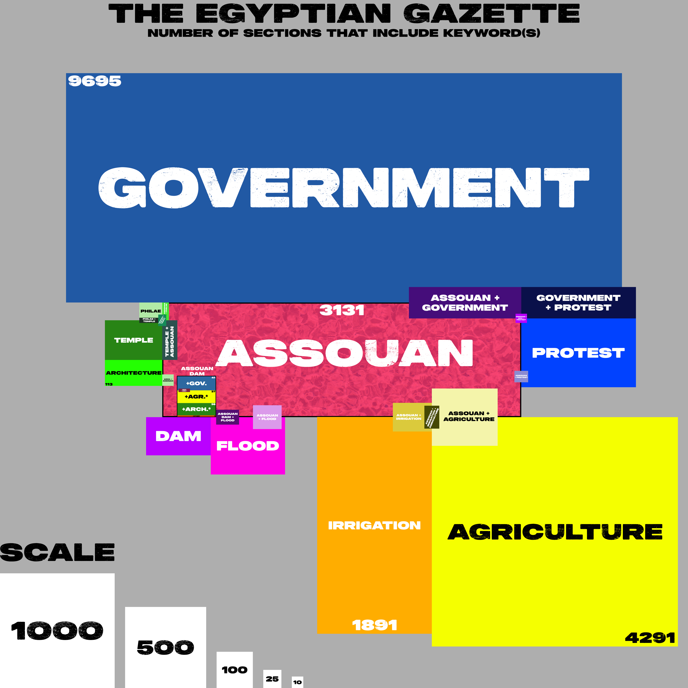
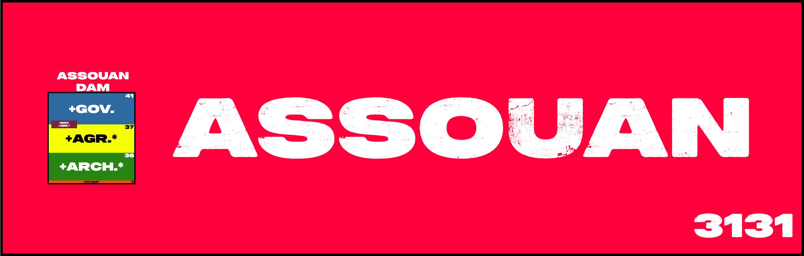
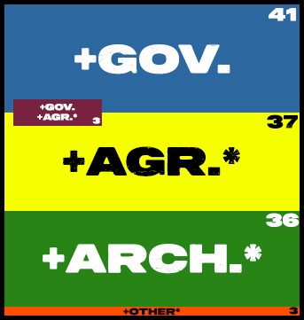

The topic I chose was the significance of the Assouan Dam in The Egyptian Gazette. Ichose this topic because I thought it would be interesting to research something that is not insideCairo or Alexandria, which makes up a majority of the Gazette’s news. When looking for a topic,I found trouble trying to find something that was significant on a global scale or at least outsideof Egypt and the Gazette. I found the Assouan Dam when I saw almost an entire half-pagededicated to it, and after further research found a story that had continued throughout the fouryears of news that is available. Assouan was an area that was both rich in agriculture as well astourism and historical importance.

Located on the border of the Upper Nile and Lower Nile, a dam was built in 1902 to helpthe agricultural industry as well as to protect Philae, an island in the Nile with an ancient templecomplex. The temples were built around 6th-7th Century BC and is Assouan’s biggest touristattraction even to this day. Due to Philae being a small island that had little elevation, it wasprone to flooding if there was no control on the water level. Cotton, grains, and lentils weremajor crops that would be exported to Cairo and presumably around the world. It required theNile to be at a steady level so that the fields would not get flooded. In early 1905, articles in theGazette showed people complaining that the dam was not high enough and floods wouldeventually come and ruin Philae and the crops. However, the government did not care, and theydid not raise the dam. In 1906, architects or scientists would show how the flooding is on track tobreach the dam. In late 1906, letters to the editor included some stern messages to thegovernment demanding for money to be allocated to the raising of the dam, still with no success.In July 1907, the dam flooded and ruined a lot of fields and flooded Philae, causing extensivedamage.

This was included in the Gazette likely because Assouan was a major agricultural hubthat would supply Alexandria and Cairo with crops. When I researched other reasons Assouanwas included in the newspaper, the most common appearances were in the export and importsections, as well as stating when ferries or boats were departing from a port to go to Assouan.This was also included because the federal government was responsible for allocating funds tothe construction and re-raising of the dam, not a local government. The Letter to the Editorssection included several messages from people who were complaining or demanding thesechanges in Assouan, so that made it a big deal up in North Egypt where the Gazette waspublished.

This analysis project looks at The Egyptian Gazette to see what context the Assouan Damis in throughout the newspaper. Originally using the ‘Find/Replace’ tool inside Oxygen XML, Icame across a lot of improper results for a lot of key words or phrases. Another issue I cameacross was word capitalization. I added a tag in my queries to make the word searches not casesensitive. Lastly, another tweak I made when querying was for the word ‘dam’ adding spacesbefore and after (‘ dam ‘) so that it would pick up whole words rather than parts of words such as ‘Damascus’. Instead of finding how many times each word was said as well, I decided to countinstances based on the number of sections included each term. This created a constant for allwords as well, just showing how relevant they were instead of how common a word was stated.One section could repeat “Assouan Dam” ten times and be as relevant as a section whose headeris “Assouan Dam” and it not stated again in the paragraphs.

The XML query format I used throughout this entire project was `//div[@type="page"]/div/p[matches(., ‘assouan’, 'i')]` or if there was multiple words I needed to search for, `//div[@type="page"]/div/p[matches(., 'asso`uan', 'i') and matches(., ' dam ', 'i')].

Prior to querying, I read about 20 sections that talked about the dam in order to see whatwas relevant to the topic. I found that a majority of sections about the dam talked or referred toone of three topics: agriculture, architecture, or the government. After initial querying, I foundthat some sections would not show up, so I had to group some keywords together into a section.Government was independent, agriculture included ‘irrigation’, while architecture included ‘temple’ and ‘Philae’. I wanted to visualize the instances of these sections in a way that wasdifferent than a bar graph. Bar graphs are efficient in showing one dimension, which is countinginstances. However, I added another dimension to the data visualization by showing overlap ofinstances between two or three keywords as well. A lot of important keywords were related,which stems back to my research topic. In order to visualize my data, I used Adobe Photoshop tocreate a landscape of rectangles that would clearly show a size difference that was based on thenumber of instances. I could not use squares or the exact same ratio rectangles because thenumber of keywords I queried for would not fit visually. In order to adapt to this issue, I made the equation:

> Instances × 1000 = size of rectangle (in pixels)

Even though the instances was multiplied by 1000, this did not mean this was the heightand width of the rectangle. 1000 was my starting point, however it was often reduced to cater tosize restrictions. If I cut 1000 in half, I would multiply the number of instances by 2 so that theshape has the exact same number of pixels still. This effectively showed the number of instancesof each term despite occasionally having different ratios. Most shapes had a width of 1000, 500,333.3, 250, or 200, all of which were easily divisible of 1000. This meant the heights of shapeswere commonly instances multiplied by 1, 2, 3, 4, or 5.

## Results and Data Visualization:

The complete results are following:

Each shape represents the number of instances. A scale is in the bottom left corner forreference. Some of the major words feature their counts for viewers to understand. Any squarewhere a ‘+’ is present means both or all of these terms are present in a section. Because ‘Assouan’ is the main keyword, despite it being the third largest, I gave it a textured design tohelp it stick out more. Shapes with a blue or similar background are related to government,yellow, gold, and orange is agriculture, greens are related to architecture, while pinks and purplesare unrelated to any of those three major topics. Inside the ‘Assouan’ shape is ‘Assouan Dam’,where inside that is what other keywords are combined.

The main data that was collected is nearly impossible to read without zooming in. Thefollowing zoomed images show ‘Assouan Dam’ in relation to ‘Assouan’, as well as the ‘AssouanDam’ topics alone.

* Section Agr. refers to (Assouan Dam + Agriculture + Irrigation)
* Section Arch. refers to (Assouan Dam + Architecture + Philae + Temple)
* Section Other refers to sections that do not include any of the following terms

‘Assouan Dam’ was referenced 117 times in the Gazette in the available issues. 114 ofthese were related to the three main topics, with only 3 being unrelated to any of those. Therewere no instances of ‘Assouan Dam’, ‘Architecture’, and ‘Agriculture’ all in the same section.However, there were 3 instances of ‘Assouan Dam’, ‘Government, and ‘Agriculture’ in the samesection, hence the shape between the two. One of the sections that was in the ‘Other’ categorywas an obituary to a deceased Assouan Dam construction worker. The other two both werebroadly about water levels. I did not make this its own section because it was not includingstatistics and it just was not relevant in the general scope of the dam throughout the Gazette.There were also only two instances, so it just did not seem appropriate to give its own section,and it fits nowhere better than ‘Other’.

What I found most interesting was how close the three major topics were in the numberof instances. This really shows that there was not one topic that had more significance thananother in the Egyptian Gazette. What it also shows is how significant the dam is to the Gazette.Over the span of about 38 months, it appeared in 117 sections. If it was only mentioned in onesection per day without multiples, this would mean it was brought up in 117 days during roughlya 1,140-day period. I do not know exactly how much attention a topic needs to be significant, butI would imagine seeing the dam in about 10% of issues over 4 years is pretty significant.Although I did not collect the dates of all these instances, I noticed that a good number ofsections that fell under the ‘government’ section came in late 1907 and in 1908 after the floodingoccurred. This makes me believe that in the issues that come after what I have access to arelikely going to include ‘government’ sections at an increased rate. Most of the sections talkedabout how the government responded to the flooding, or people writing editorials complainingabout the lack of help the government offered before and after the flooding.

A potential future project could be looking at how these instances progressed by year inorder to see if there were trends. Perhaps using this chart and making the solid color a gradientbased on how many instances each topic saw in a year or month even. Another question I have iswondering if the most significant topic connected to Assouan was not the dam. The mostcommon results are through advertisements and ferries, but I would like to compare the damtopic in its entirety to another topic if there is a major one present.