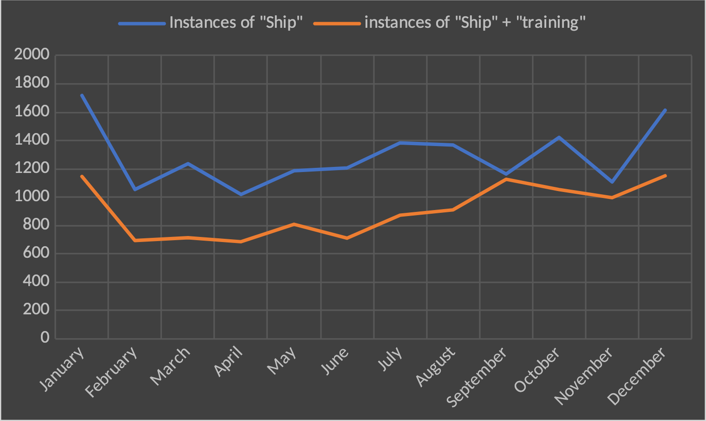
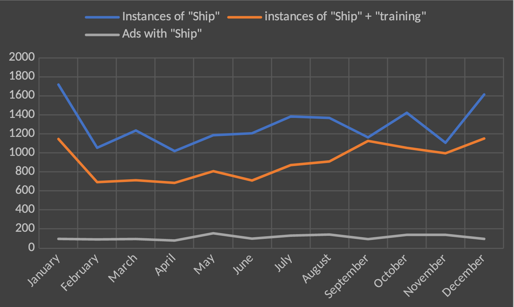
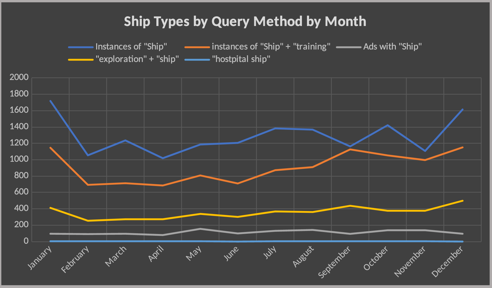

Ship technologies have been constantly evolving since their inception many thousands of years ago. In the early 20th century, there were many different uses ships had and different roles. Various types of ships throughout the turn of the century included the traditional wooden sailing ships and the now established steam ships. Journeying by sea had become one of the premier travelling and transport methods for a world that was quickly becoming globalized. Alexandria, Egypt, being a thriving port city, was an epicenter of international and local naval operations including trade & commerce, military, fishing & industry, scientific expeditions, construction & repair operations, leisure cruises, postal services, humanitarian aid/rescue vessels, navigation aids, event/celebration ships, diplomatic & international relations, and health and quarantine services. Throughout the current database of the Egyptian Gazette there are approximately 15,500 instances of the word "ship" being used which means that there is lot of information pertaining to them. The research question in this analysis is to distinguish the prevalence of different ship types as well as to find any patterns that emerge throughout the Gazette. To carry this out I used different querying methods to build up a database of ships. 

For Instance, here are some instances of examples where trading ships are being found by combining terms. 

- `"Trade" + "Ship" `         190 instances
- `"Merchant" + "Ship" `         81 intances

To make sure that the instances accurately reflect what I am trying to find some exclusion terms have proved helpful in conjunction with the other queries.
For example,

- `//p[contains(.,'ship')]/text() | //p[contains(.,'ship')]/*[not(contains(.,'passage'))]/text()`
- `//p[contains(.,'ship')]/*[not(contains(.,'travel'))]/text()`
- `//p[contains(.,'ship')]/*[not(contains(.,'training'))]/text()`
- `//p[contains(.,'ship')]/*[not(contains(.,'passengers'))]/text()`
- `//p[contains(.,'ship')]/*[not(contains(.,'soldier'))]/text()`
- `//p[contains(.,'ship')]/*[not(contains(.,'trade'))]/text()`
- `//p[contains(.,'ship')]/*[not(contains(.,'canal'))]/text()`

Another method is finding paragraphs with multiple terms within them.

- `\w+(?=repurposed?)`
- `\w \w+ [ship] (?=repurposed?)`
- `[\w\w*] [\w\w*] repurposed[^t].?[\w\w]*[\w\w]`
- `//div//div[matches(.,'ship','i')][matches(.,'repurposed','i')]`

These are not perfect querying methods by any means, but it helps narrow down the data by a significant amount. 

One question was to explore how seasonal changes might affect the different types of ships mentioned in the Gazette. Because months is an easy way to sort the data this is why seasons were chosen. To begin with I first started with the term "ship" as it appeared in different months. Here are those results:

|**month**|**count**|
|---|---|
|Jan | 1718|
|Feb | 1054|
|March | 1236|
|April | 1019|
|May | 1186|
|June | 1206|
|July | 1383|
|August | 1368|
|September | 1163|
|October | 1422|
|November | 1107|
|December |1614|

This is a good baseline and could form some initial hypothesis as to why there is an influx of mentions in the months of January and December. Could it have to do with trade? Seasonal tourism?

To further explore this, I took containing "ship" and the common word "training" which is associated with military uses and found paragraphs that contain both terms and had this compared across each month. 

|**month**|**count**|
|---|---|
|Jan | 1146|
|Feb | 693|
|March | 713|
|April | 685|
|May | 808|
|June | 710|
|July | 872|
|August | 910|
|September | 1126|
|October | 1053|
|November | 996|
|December |1151|

What initially stands out with this data is how September contains nearly the same mentions as the baseline query which may suggest an above normal level of conflict during this period.

This chart is the first indication of a trend occurring with a slight deviation with regards to September. One possibility for this deviation was the conflict in Fashoda on September 18, 1898, "An army of 1,500 British and Egyptian soldiers and five gunboats under the command of Field Marshall Horatio Herbert Kitchener, fresh off of a victory over the Dervishes of the Sudanese Khalifa near Omdurman, was dispatched, and arrived at Fashoda on September 18.  A standoff was ignited; newspapers in both France and Britain fanned the flames; war orders were drafted and troops mobilized; and diplomats scurried to prevent a colonial war." (LOC)
The next step was to query div types that were adverts which contain certain text that I am looking for. Using `//div[@type="advert"]//p[contains(.,' ship')]/text()`, I could search for instances of ships within advertisements which was overwhelmingly transport ships. This query resulted in 1351 instances. Broken down by year and compared to the previous results it looks as so:

While the new chart may tell us that maybe the ads containing "ship" are simply a more uniform occurrence, but observing the relative frequency of the ads versus the other data sets by month might be a better method. 

| Month     | Ads with "Ship" | total by month | Ad RF |
| --------- | --------------- | -------------- | ----- |
| January   | 95              | 2959           | 3.21% |
| February  | 91              | 1838           | 4.95% |
| March     | 95              | 2044           | 4.65% |
| April     | 79              | 1783           | 4.43% |
| May       | 155             | 2149           | 7.21% |
| June      | 99              | 2015           | 4.91% |
| July      | 131             | 2386           | 5.49% |
| August    | 142             | 2420           | 5.87% |
| September | 94              | 2383           | 3.94% |
| October   | 138             | 2613           | 5.28% |
| November  | 137             | 2240           | 6.12% |
| December  | 95              | 2860           | 3.32% |

Given this data, advertising with ships is more frequent relative to other instances of ships in the months of May, November and possibly August. 

| **Months** | **Instances of "Ship"** | **instances of "Ship" + "training"** | **Ads with "Ship"** | **"Exploration" + "ship"** | **"Hospital ship"** |
| ---------- | ----------------------- | ------------------------------------ | ------------------- | -------------------------- | ------------------- |
| January    | 1718                    | 1146                                 | 95                  | 412                        | 1                   |
| February   | 1054                    | 693                                  | 91                  | 254                        | 2                   |
| March      | 1236                    | 713                                  | 95                  | 270                        | 5                   |
| April      | 1019                    | 685                                  | 79                  | 272                        | 4                   |
| May        | 1186                    | 808                                  | 155                 | 338                        | 3                   |
| June       | 1206                    | 710                                  | 99                  | 301                        | 0                   |
| July       | 1383                    | 872                                  | 131                 | 368                        | 1                   |
| August     | 1368                    | 910                                  | 142                 | 361                        | 3                   |
| September  | 1163                    | 1126                                 | 94                  | 437                        | 1                   |
| October    | 1422                    | 1053                                 | 138                 | 379                        | 3                   |
| November   | 1107                    | 996                                  | 137                 | 374                        | 1                   |
| December   | 1614                    | 1151                                 | 95                  | 499                        | 0                   |
| Total      | 15476                   | 10863                                | 1351                | 4265                       | 24                  |

Great, so what does all this mean? Well, there is some indication that a trend exists among some of the data, generally there is an uptick with ship mentions around December and January. What this could mean in terms of cause and effect is not an easy question to answer. One of the challenges when working with the data at hand was the overwhelming quantity of unnecessary instances coming up from the initial results. So being able to use a combination of querying methods as well as visual representations gives a different kind of approach when it comes to tackling some questions about the *Egyptian Gazette*. 

While trying to see how this data might lead to understanding the Gazette better, by looking at how ships are mentioned based on their use, it can show more broadly what the paper geared itself more towards. For instance, in my findings military uses outweighed all other categories when it came to ships which could indicated a strong focus on politics and war. Interestingly the scientific uses of ships was more prevalent than say hospital ships. The data and queries in this investigation were not perfect by any means and served more than anything as a way to shave off unwanted results while trying as best as possible to maintain the results wanted. 

## Work Cited
https://blogs.loc.gov/maps/2020/04/when-pride-mattered/