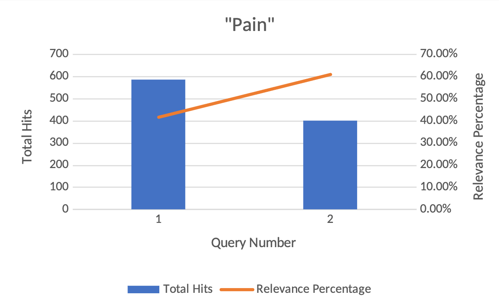
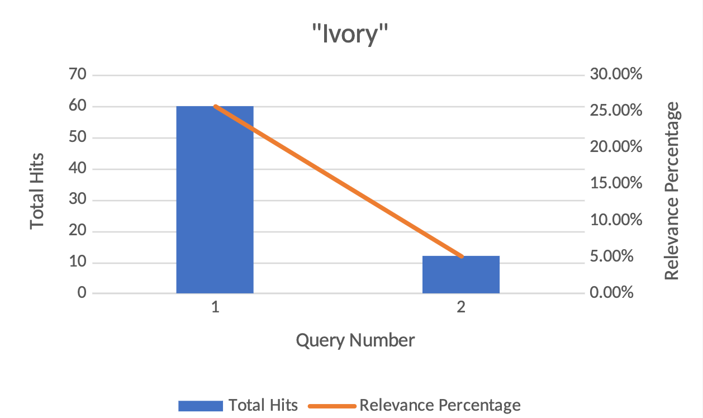
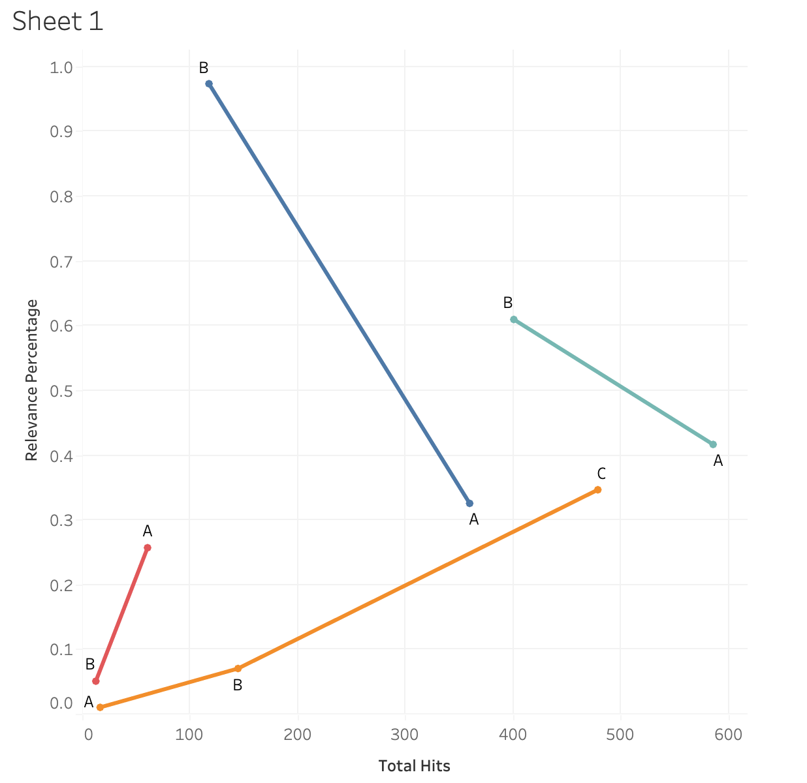

An issue faced by all the members of our group, when doing individual analysis, was getting narrower results for our related research questions, while making sure our queries still had enough relevant results. In order to tackle this issue, we devised a methodology to test the relevance of the queries used in our individual analysis. For future research projects, I have outlined the basic process below:

1. Gather relevant keywords to your research question. Try to get a list of at least 5 or so words that are concise enough to yield relevant results, but not too little. 
2. Run count queries for those words and keep track of how many results you get for each. If you can, look at some of the results, and see if there are any “stock words” that you can use to exclude in subsequent queries.
3. Run more queries with narrower parameters and keep track of how many results are yielded. Make sure to exclude stock words.
4. Divide the number of narrow queries by the more generalized result and calculate the percentage. 
5. With these percentages, you can now tell how relevant your specifications are, in regard to your larger research question. If some queries are only 2% of the larger data pool, that would likely be not as significant compared to a query of 38%. Interpreting this data and incorporating it into your individual analysis can be done however you choose.

The overall purpose of this method is to provide a quick way to clarify and measure the relevancy of potential queries you may have for your project. Seeing how correlated your queries are to larger ideas and phrases that are present in the Egyptian gazette can help gather a more concise data pool to draw on for your analysis. 

## What we were trying to accomplish (as a group and as an individual)
The purpose of this was to determine how effective a certain query was at returning results relevant to what was being researched. A lot of our initial queries returned hundreds of results, but only a certain percentage of those results contained any relevant information. Furthermore, there was often a pattern in the initial query’s results that allowed for the exclusion or inclusion of certain words or terms to help narrow things down. Because of this, we used the method of refining our initial queries and calculated a percentage to determine the relevance of the results produced.

One example of this was a query used to find associations with the word “pain” in the paper. The initial query returned 585 results with only 244 of those results being relevant. The other 341 results contained information irrelevant to what was being sought after. This means that the initial query was about 41.7% successful at returning relevant results. Obviously, there is room for improvement. Interestingly, about 31.6% of the results from the initial query contained the word “painting”. Clearly, these results were not relevant to what was being sought after, so by running the query again but excluding the word “painting” this time, the results proved to be far more relevant. This time, 61% of the results contained relevant information. This is about a 20% difference between the two queries, meaning that, now, most of the results contain relevant information.

Another example was finding specific words associated with “ivory”. While Ivory itself gave 233 results, divs containing “packages ivory” came to 60 results, or roughly a quarter of all instances of Ivory. Searching for divs that contained both the words “ivory” and “tusk” gave only 12 results (5% of all results) , which meant that there was far less results to use in my analysis. By having these numbers available, I knew how I wanted to guide my research, and was able to use the 12 results for a more in-depth analysis, while packages of ivory could give raw data in discussing the context in which animals were viewed in the Egyptian gazette.

This example shows queries to find sections that included words associated with the Assouan Dam. This was a bit more complex as the keyword is two different words. This required the query to add sections that would include “Assouan Dam” or (“Assouan” and “Dam”) together. There were 96 initial results for “Assouan Dam” and 263 counts of “Assouan” and “Dam” not including “Assouan Dam”. This was a total of 359 results, with 114 being relevant. This shows that 32.6% of results were relevant. There were a lot of irrelevant results caused by the word “Dam”. For instance, this brought up information related to “Damascus” or “Rotterdam”. The query search was updated to look for “Assouan” and 	           “ Dam “. This included a space before and after “dam” so that it would search for whole words only. This created a total of 117 results, meaning only 3 results were not relevant. This query resulted in a 97.4% relevant return.

This graph compiled all our relevancy trends into one chart, where ivory was in red, pain in teal, assouan dam in blue and Ryan’s in orange. Blue and teal each had similar trends, where the initial query was much larger than the later queries, but held less relevance. In the “pain” query case, that word gave more hits because it was in words like “painting”, which were not relevant to the analysis project. Future queries narrowed down the results, but made them more relevant to the subject being studied. Ryan’s analysis (orange) began with very few results and relevancy, and as the search went on, more accurate and functioning queries were made, which yielded more relevant results. The assoaun dam query, similar to “pain” dealt with multiple spellings and context for the dam. As the queries narrowed down, proper spelling, along with proper context increased, though total number of hits decreased. For the ivory query, there were multiple instances of the word mentioned, which had a lot of relevancy to the main topic. As the queries narrowed, they were designed to see if two subjects were at all related in relevancy, to test the hypothesis of the analysis. As the results narrowed, so to did the relevacny, which was valuable to the data gathered regarding the ivory trade.

## How future students can use it
Our method of breaking down larger queries into more concise, filtered results was intended to help guide early research questions, and determine what stock words could be included (or excluded) from narrower queries. For future students of this class, using a simple graph to evaluate their early queries can help them visualize how feasible their potential research topic is. Additionally, from a learning perspective, running a multitude of queries allows for students to familiarize themselves with the markup language, and provides an opportunity to tinker around and see what works and what doesn’t, while still yielding useful data in their project.

This process is designed to be easy to use, quick to analyze, and simple to explain to others, as all you need to do is find a main word to search for, and produce as many smaller queries that you would like that contain that word. It is easy enough to divide the two results and make a bar graph to see how strongly related your queries are. If a future student were to query a word, like “army” and get back thousands of results, they could run finer searches that would exclude words, include the word “british”, or only find results on the third page, and see how much that skims down their data pool. If the pool is too shallow, it may not be the best to research. But if the data pool contains enough substantial evidence, while still being reasonable to look through, then that would pose a much more compelling research topic. This methodology we’ve designed is meant to help sort out and organize this process.

## Conclusion
All in all, we felt like this methodology was effective in the very early stages of posing your analysis question. Filtering out false positives (like with the word “painting”) can be done before more refined queries are made, and a general sense of what data you are working with can be seen early on. Otherwise, this method felt lackluster for the more in-depth steps of our research projects because all it can provide is a preliminary visualization of where your data will lead you. However, this process does help provide a simple foundation and direction for the task at hand and the method used was successful at doing just that. For future classes, this would be most effective as a suggestion made towards students running a large query that contains too many results to narrow down their findings, or to help those with very little results broaden their scope.