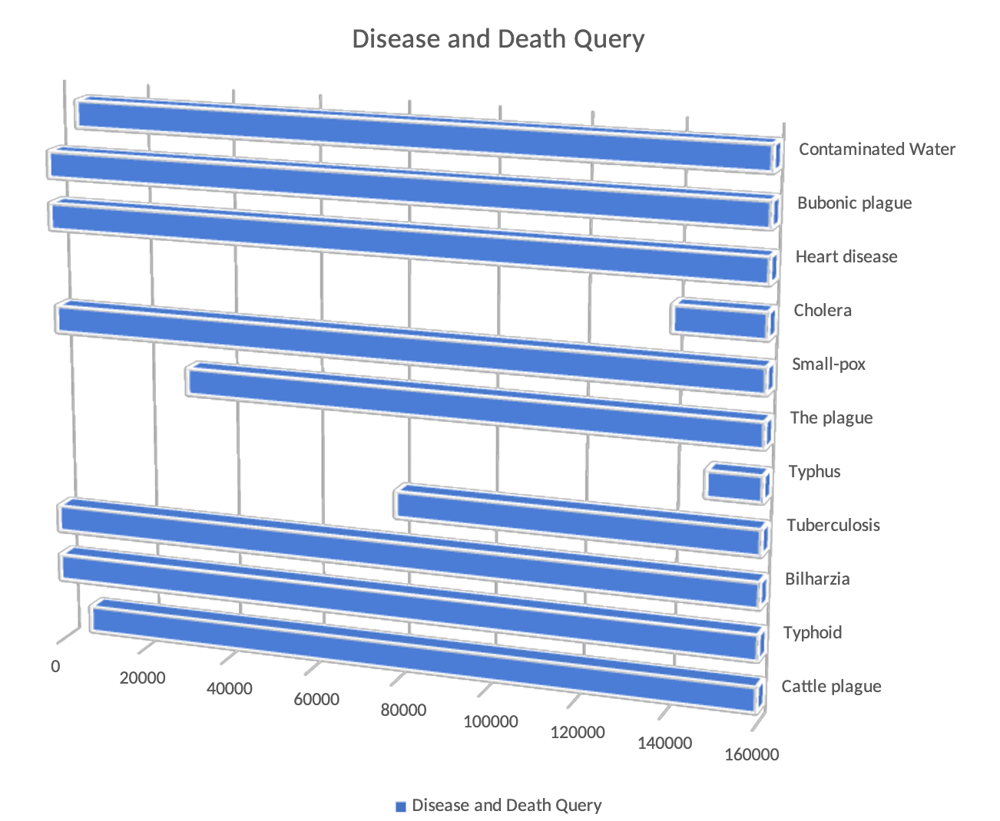
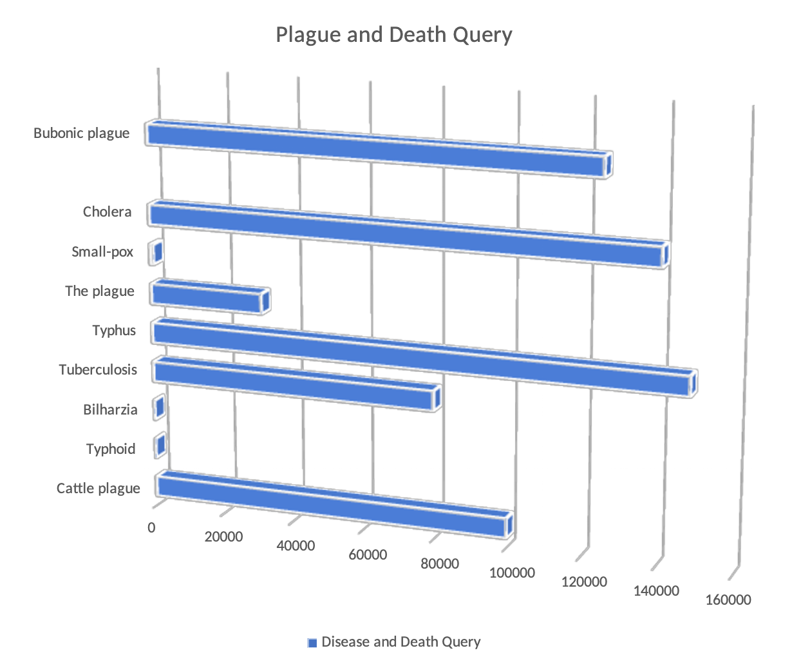

Throughout my studies of the Egyptian Gazette, I always wondered how diseases affected the lifestyles and events of history. There was very minimal medicine research in this time period of 1904-1908, so death from illness seemed to be very common. When I found out about this project, I decided to try to gather information on what diseases affected the population the most. When I started querying, I was just simply searching using the word “disease”. I found interesting results, but I felt that there had to be more. I then started searching with the keywords “illness” and “plague”. I found more results and different types of conditions. Once I gathered some data, I started doing a more detailed query of searching for two words located in the same paragraph. I first started off with searching for “illness” and “death” in the same paragraph. I got minimal results, only 16 with three deaths reported from three different illnesses. This confirmed my thought of how illness wasn’t a descriptor in this time, and it seemed that illness was a word to describe less serious conditions. To prove, the main query for the word illness had 1,376 results. Next, I searched for “disease” and “death” in the same paragraph and got significantly more results. I was able to get a close estimate for the number of deaths from eleven diseases. Also, this query had more relevant results. Lastly, I searched for plague and death in the same paragraph and 1450 results. This helped me conclude that plague was more commonly used to describe conditions. Also, many of the conditions’ formal names had “plague” in them, which also led to more results. Throughout my searching time, I wrote down the data. When it came time to display the data, I initially chose to use a pie chart. However, I was recommended that this method was ineffective, so I changed the display to bar graphs. This helps the reader to get a better visual of the differences in the data. What sets my project apart from others studying a similar topic is that I do a more efficient search process by using three different key words instead of just one broad search. Also, I look at other readings and get a broad viewpoint on the topic. Thus, the trial-and-error process of this project allowed me to get a better understanding of the data, and the outside source (described below) helped me link the data together. 

Illness and Death Query only had 3 deaths from three different illnesses: Long illness, meningitis, and small pox
- `//div//div[matches(.,'illness','i')] [matches(.,'death','i')]`: 16 Results
- 1.1% of illness query: `//div[contains(., "illness")]`: 1376 Results

- `//div//div[matches(.,'disease','i')] [matches(.,'death','i')]`: 144 Results
- 7.1% of disease query: `//div[contains(., "disease")]`: 2016 Results

- `//div//div[matches(.,'plague','i')] [matches(.,'death','i')]`: 478 Results
- 34.7% of plague query: `//div[contains(., "plague")]`: 1400 Results

To give a description of the causes of diseases, I re-read a reading from one of our assigned readings called “Cruel Summer”. It talks about the illnesses mentioned in the data above, but it also brings up new diseases. First, a huge factor in the impact of diseases is the seasons. In Egypt, the dryness of Spring served as a carrier for diseases, and the air was not good for the lungs. On the other hand, warm weather stimulated the parasites lurking in the crops. Bacterial eye infections were extremely common from the summer heat. Farmers realized that there needed to be a change with the maintenance of crops, causing irrigation to be a new technique brought to the table. The title “Cruel Summer” is fitting for this article because of how the people suffered with the heat-induced diseases. Linking to the data, the article mentions that a very prevalent disease in agriculture was bilharzia. The article explains the cause of the virus, which isn’t mentioned in the gazette. It is caused by open skin wounds contacting water that contains the parasite. Also, for the demographics of infections, men were most vulnerable to parasite infection. At around 1908, scientists like Bonte Elgood were studying anatomy and trying to see what parts of the body the diseases affected. Also, new research methods started developing. For example, Elgood did a study of finding a percentage of urine samples with a certain virus. Next, it was obvious that World War I caused disease to spread because of the transportation of goods and soldiers. As the world was improving in technology and transportation, Egypt was seeing more diseases. This was at the threshold of new medicine advances. In summary, the data from the gazette and “Cruel Summer” link together and explain the context of the time. 
